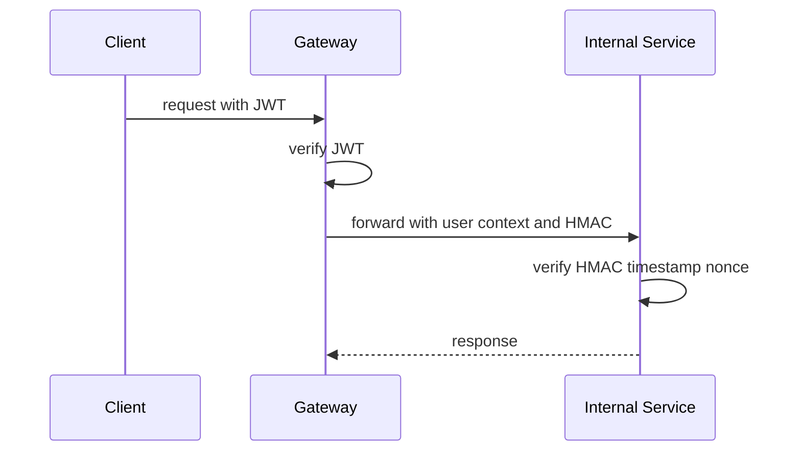

# 内部 HMAC 鉴权

> 文档状态：当前实现
> 适用范围：架构设计 / 安全 / 后端开发
> 最后更新：2026-06-26

## 1. 文档目的

本文档从架构角度说明 Gateway 到内部服务之间的 HMAC 鉴权。它回答内部服务为什么不能直接信任客户端传入的用户头，以及如何防止伪造 `X-Auth-Verified`。

## 2. 适用范围

适用于 Gateway、Auth、Problem API、Judge API 和 shared security 代码维护者。

## 3. 当前实现

Gateway 代理内部请求时签名，内部服务验证签名、timestamp 和 nonce。验证通过后，内部服务才使用转发的用户上下文。

## 4. 目标设计

后续可实现 key rotation、双 key 灰度和集中 secret 管理。即使扩展机制，默认行为仍必须 fail closed。

## 5. 关键流程

## 6. 配置说明

内部 HMAC key 由环境或服务配置注入。不同服务必须使用一致的 active key。健康检查只能报告 key 状态，不返回明文。

## 7. 安全边界

HMAC 保护内部服务信任边界，不替代业务权限。Worker API 还必须校验 worker token。

## 8. 验收方式

伪造 `X-Auth-Verified` 请求失败；过期 timestamp 失败；重复 nonce 失败；普通用户不能绕过 Gateway 调内部服务。

## 9. 常见问题

- 代理全失败：检查 key 是否一致。
- 重放校验异常：检查 Redis/nonce 存储。
- 时钟偏移：检查主机时间同步。

## 10. 相关文档

- [安全边界](../security/security-boundary.md)
- [内部 HMAC 安全文档](../security/internal-hmac.md)
