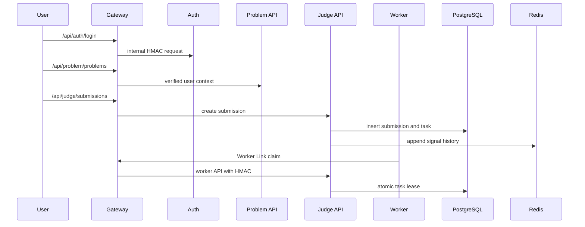

# 服务拓扑

> 文档状态：当前实现
> 适用范围：架构设计 / 部署 / 运维
> 最后更新：2026-06-26

## 1. 文档目的

本文档说明 OJOS 当前真实服务拓扑，帮助开发、部署和运维人员理解每个服务的职责、入口、配置、暴露边界和依赖关系。本文只描述当前仓库已存在的服务，不把目标架构中的模块注册器或 Contest 模块写成当前实现。

## 2. 适用范围

适用于本地开发、Control Plane 部署、worker 接入、健康检查、故障排查和安全审计。阅读本文后，应能判断某个接口应当通过 Gateway 访问，还是只允许内部服务调用。

## 3. 当前服务清单

| 服务 | 路径 | 入口文件 | 配置文件 | 暴露方式 | 职责 |
| --- | --- | --- | --- | --- | --- |
| Frontend | `frontend` | `frontend/src/main.ts` | `frontend/.env.example` | Web 静态资源 | 用户与管理员界面 |
| Gateway | `services/gateway` | `services/gateway/gateway.go` | `services/gateway/etc/gateway.yaml` | public | API 入口、JWT 校验、代理、内部 HMAC 签名、Module Registry v0 只读 admin API |
| Auth | `services/auth` | `services/auth/auth.go` | `services/auth/etc/auth.yaml` | internal | 登录、注册、当前用户、权限管理 |
| Problem API | `services/problem-api` | `services/problem-api/problemapi.go` | `services/problem-api/etc/problemapi.yaml` | internal | 题目元信息、CRUD、题目包校验 |
| Judge API | `services/judge-api` | `services/judge-api/judgeapi.go` | `services/judge-api/etc/judgeapi.yaml` | internal / worker-only via Gateway | 提交、结果、Worker Link、评测管理 |
| Judge Worker | `services/judge-worker` | `services/judge-worker/src/main.rs` | `services/judge-worker/config/languages.yaml` | worker node outbound | 编译、运行、checker、上传结果 |
| Shared | `services/shared` | Go packages | 无独立进程 | library | JWT、权限、HMAC、日志、数据库公共工具 |
| PostgreSQL | compose service | - | `.env` / compose | internal | 数据事实源 |
| Redis | compose service | - | `.env` / compose | internal | signal history、nonce、缓存 |
| Storage | `storage/` 或配置路径 | - | 服务配置 | internal | 题目包、源码、结果 artifact |

## 4. Module Registry v0

当前 Gateway 内实现了 Module Registry v0。它在启动时把 Kernel 内置模块和 `ojos.judge-core` 幂等写入 module registry 表，并提供只读 admin API：

- `GET /api/admin/modules`
- `GET /api/admin/modules/sets`
- `GET /api/admin/modules/topology`
- `GET /api/admin/modules/:id`

这些 API 只供管理员查看集合、模块、依赖、组件和安装状态。它们不执行 install、enable、disable、upgrade 或 uninstall。`modules/judge-core/module.yaml` 是 Judge Core 的 builtin manifest，B Contest 尚未开始。

## 5. 暴露边界

- Public：Frontend 和 Gateway。
- Internal：Auth、Problem API、Judge API、PostgreSQL、Redis、artifact storage。
- Worker-only：`/api/judge/worker/*`，通过 Gateway 暴露但必须携带 `X-OJOS-Worker-Token`。
- Admin：`/api/admin/*` 和 `/api/*/admin/*`，必须后端权限校验。

## 6. 关键流程

## 7. 依赖关系

- Gateway 依赖 Auth、Problem API、Judge API 的网络地址和内部 HMAC 配置。
- Auth 依赖 PostgreSQL。
- Problem API 依赖 PostgreSQL 和 artifact storage。
- Judge API 依赖 PostgreSQL、Redis、artifact storage 和 worker token 配置。
- Judge Worker 依赖 Gateway URL、worker token、nsjail、cgroup v2 和语言工具链。

## 8. 健康检查

`GET /api/admin/health` 由 Gateway 聚合健康状态。它应检查 Gateway、Auth、Problem API、Judge API、PostgreSQL、Redis、artifact storage、worker online count、queue health 和 internal auth key status。

## 9. 安全边界

内部服务不能公开 host port 给普通用户。客户端伪造 `X-Auth-Verified` 不应生效，因为内部服务必须校验 Gateway HMAC。worker 不应拥有 PostgreSQL 或 Redis 凭据。

## 10. 验收方式

- `scripts/verify-static.ps1 -SkipDockerBuild` 通过。
- Gateway 代理 Auth、Problem、Judge 路由正常。
- 普通用户无法访问 admin API。
- `/admin/modules` 与 `/admin/modules/topology` 能展示真实 registry 数据。
- worker token 错误时 Worker API 拒绝。

## 11. 常见故障

- Gateway 代理失败：检查服务地址、端口和 HMAC key。
- Auth 登录失败：检查 PostgreSQL 和 JWT secret。
- Problem 包校验失败：检查 storage 权限和题目包格式。
- Judge 长时间无任务：检查 Redis signal、PostgreSQL task 和 worker heartbeat。
- 模块拓扑为空：检查 `000009_module_registry` 是否迁移，以及 Gateway bootstrap 是否成功。

## 12. 相关文档

- [架构总览](overview.md)
- [Worker Link 协议](worker-link-protocol.md)
- [健康检查](../operations/health-checks.md)
