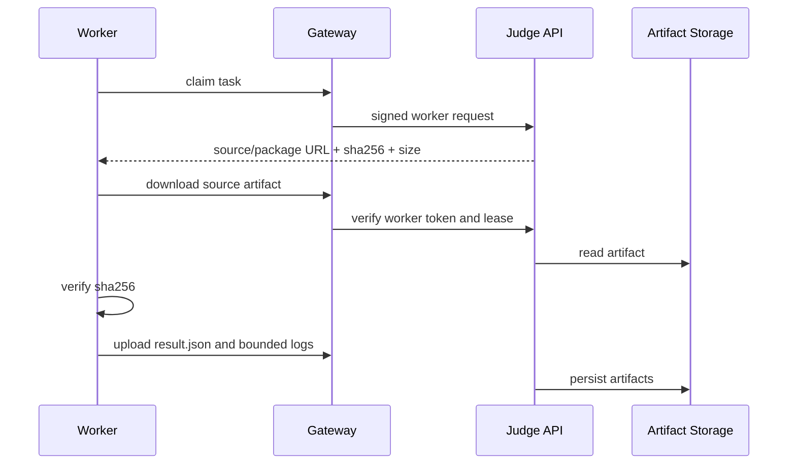

# Storage 与 Artifact 模型

> 文档状态：部分实现
> 适用范围：架构设计 / 部署 / Judge Worker / 安全
> 最后更新：2026-06-26

## 1. 文档目的

本文档说明 OJOS 中 storage 和 artifact 的边界。它解决三个问题：Control Plane 内部如何保存题目包和提交结果，远程 worker 如何安全获取评测所需文件，以及 Public API 为什么不能返回服务器本地路径。

## 2. 适用范围

本文档适用于维护 `services/problem-service`、`services/judge-api`、`services/judge-worker`、部署 storage、排查 artifact 下载失败和做路径泄露审计的开发者。

## 3. 当前实现

当前本地开发和 Control Plane 使用本地文件系统作为 artifact storage：

- `storage/problems`：题目包、题面、case、checker/scorer/runner 配置。
- `storage/submissions`：提交源码、`result.json`、截断日志和 case result artifact。

这些路径只属于 Control Plane 内部实现。`Problem API` 负责读取和校验题目包，`Judge API` 负责为 worker 提供 artifact 下载和 result 上传入口。

## 4. 目标设计

目标是把 worker 契约稳定为 URL + sha256 digest + size limit。后续无论存储后端是本地文件系统、S3、MinIO 还是其他对象存储，worker 都不应感知本地路径变化。

## 5. 关键流程

## 6. 配置说明

Control Plane 的 artifact root 来自服务配置或环境变量。worker 侧使用 `OJOS_ARTIFACT_CACHE_DIR` 保存下载缓存，但缓存只作为临时加速，不能成为事实源。

## 7. 安全边界

Public API 不允许返回绝对路径、内部路径字段或主机目录结构。远程 worker 不允许挂载 `storage/problems` 或 `storage/submissions`。artifact 下载必须校验用户权限或 task lease。

## 8. 验收方式

- 提交详情和题目包 API 不返回内部路径。
- worker 下载源码和题目包后校验 sha256。
- result 上传时校验 task owner 和 `lease_version`。
- E2E 响应汇总保持 `path_leaks=0`。
- 人工审查 public DTO、前端展示和 worker artifact 响应不包含本机路径字段。

## 9. 常见问题

- worker 下载失败：检查 worker token、task lease 和 artifact 是否存在。
- digest mismatch：检查 artifact 是否被替换或缓存损坏。
- 前端看到本地路径：说明 API schema 或转换层泄露内部字段，必须修复。
- 多机 worker 找不到文件：确认没有依赖本地挂载，应走 Worker API。

## 10. 相关文档

- [Worker Link 协议](worker-link-protocol.md)
- [路径泄露防护](../security/path-leak-prevention.md)
- [Worker API](../api/worker-api.md)
