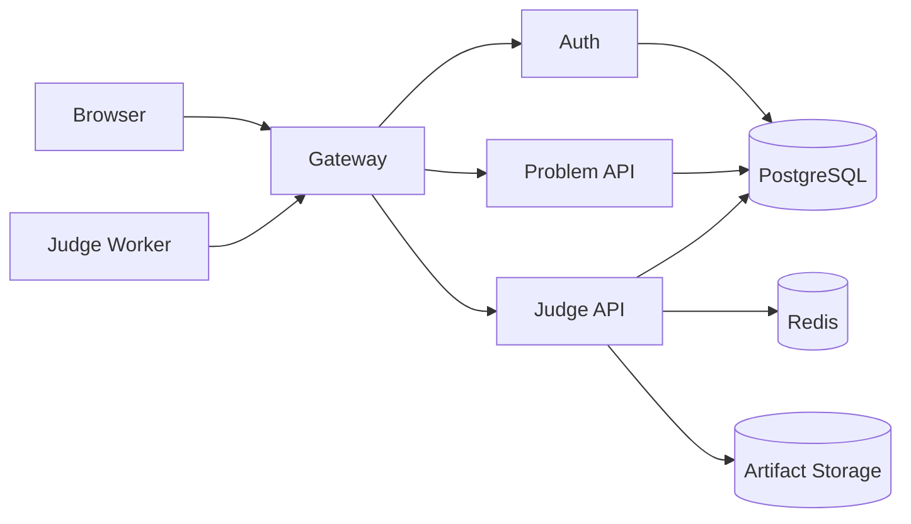

# Control Plane 部署

> 文档状态：当前实现
> 适用范围：部署 / 运维 / 安全
> 最后更新：2026-06-26

## 1. 文档目的

本文档说明 OJOS Control Plane 的部署方式和安全边界。Control Plane 是 OJOS 的主控平面，负责用户认证、题目管理、提交管理、任务调度、artifact 存储、管理员页面和 Worker Link API。

## 2. 适用范围

本文档适用于本机开发部署、单机生产式部署和为远程 worker 提供控制端服务的部署场景。真正的多机 worker 运行验收需结合 [Worker Node 部署](deploy-worker-node.md)。

## 3. 当前实现

Control Plane 包含：

| 服务 | 路径 | 作用 |
| --- | --- | --- |
| `gateway` | `services/gateway` | 唯一公开 API 入口、JWT 校验、内部 HMAC 签名 |
| `auth` | `services/auth` | 登录、注册、当前用户、角色权限管理 |
| `problem-api` | `services/problem-api` | 题目 CRUD、题目包校验、题目可见性控制 |
| `judge-api` | `services/judge-api` | 提交、结果、Worker Link、评测集群管理 |
| `frontend` | `frontend` | Vue 3 用户和管理界面 |
| PostgreSQL | compose service | 用户、题目、提交、task lease 的事实源 |
| Redis | compose service | signal history、nonce 和轻量缓存 |
| artifact storage | `storage/` 或配置路径 | 题目包、源码、结果文件 |

## 4. 目标设计

当前本地 artifact storage 可运行，目标设计是保持 artifact 协议稳定，后续可替换为 S3 或 MinIO。无论后端存储如何变化，worker 都只能通过 Worker API 下载和上传 artifact。

## 5. 关键流程



部署原则：`Gateway` 是唯一公开入口。PostgreSQL、Redis、`auth`、`problem-api`、`judge-api` 不公开暴露。

## 6. 配置说明

复制环境模板并替换占位值：

```powershell
Copy-Item .env.example .env
```

关键配置包括：

- `JWT_SECRET`：必须使用强随机值。
- `INTERNAL_HMAC_KEY`：Gateway 与内部服务之间的签名密钥。
- `POSTGRES_DSN`：只供 Control Plane 内部服务使用。
- `REDIS_ADDR`：只供 Control Plane 内部服务使用。
- `OJOS_WORKER_TOKEN`：Worker API token，必须与 worker node 配置一致。
- `ARTIFACT_ROOT`：Control Plane 本地 artifact 根目录。

生产环境不能使用示例 secret，不能把 secret 写入文档、YAML 或 Git。

## 7. 部署命令

Docker daemon 可用时：

```powershell
docker compose --env-file .env -f deploy/compose/docker-compose.yml up -d --build
```

仅做静态验证时：

```powershell
powershell -NoProfile -File scripts\verify-static.ps1 -SkipDockerBuild
```

数据库迁移文件位于 `deploy/migrations/`。迁移必须随发布执行，不允许手工改库后跳过迁移记录。

## 8. 安全边界

- Public：前端与 `Gateway`。
- Internal：`auth`、`problem-api`、`judge-api`、PostgreSQL、Redis。
- Worker-only：`/api/judge/worker/*`，需要 `X-OJOS-Worker-Token`。
- Admin：`/api/admin/*` 和 `/api/*/admin/*`，需要管理员权限。

健康检查不能返回 DSN、secret、worker token 或 HMAC key。

## 9. 验收方式

- `docker compose config` 通过。
- `scripts/verify-static.ps1 -SkipDockerBuild` 通过。
- 前端通过 Gateway 调用真实 API。
- 普通用户访问 admin API 返回 403。
- worker token 错误无法注册。

## 10. 常见问题

- Docker daemon 不可用：只能完成静态验证，不能声明容器运行通过。
- Gateway 502：检查内部服务地址和 HMAC 配置。
- 登录失败：检查 `auth` 日志、PostgreSQL 连接和 JWT secret。
- worker 注册失败：检查 `OJOS_WORKER_TOKEN` 与 Gateway 到 Judge API 转发。

## 11. 相关文档

- [Docker Compose 说明](docker-compose.md)
- [环境变量参考](env-reference.md)
- [生产加固](production-hardening.md)
- [Worker Node 部署](deploy-worker-node.md)
## 2026-06-26 Docker API 验收补充

部署 Control Plane 后必须执行真实运行时验收：

```powershell
docker compose --env-file .env -f deploy\compose\docker-compose.yml up -d --build
powershell -NoProfile -File scripts\e2e-api.ps1 -BaseUrl http://localhost:8080/api -AdminUsername admin1 -AdminPassword admin123 -UserUsername user1 -UserPassword user123 -WorkerToken $env:OJOS_WORKER_TOKEN
```

验收会检查 Gateway 是唯一公开 API 入口，内部 `auth`、`problem-api`、`judge-api`、PostgreSQL、Redis 不通过 compose 发布到宿主机；Jaeger 仅绑定本机 loopback 作为开发/预生产观测入口，生产环境如需访问必须放在受控反向代理、鉴权和网络 ACL 之后。前端开发环境跨端口调用 Gateway 时，需要 Gateway CORS preflight 正常返回 204。
# 2026-06-27 Module Installer 部署补充

Control Plane compose 新增 `module-installer` 内部服务。该服务使用 Rust 编写，只通过 compose network `expose: 8090` 提供内部 API，不把端口发布到宿主机。

安全边界：

- 只读挂载 `modules/` 到 `/workspace/modules`。
- 不挂载 `.env`。
- 不挂载 `.tmp`。
- 不挂载 Docker socket。
- 不使用 host network、host PID 或 privileged 容器模式。
- `read_only: true`、`no-new-privileges:true`、`cap_drop: ALL`，并用 `/tmp` tmpfs 提供临时目录。
- 不具备执行任意模块脚本的能力。
- 不支持远程模块市场。

Gateway 通过以下环境变量访问它：

```text
MODULE_INSTALLER_ENDPOINT=http://module-installer:8090
MODULE_INSTALLER_INTERNAL_TOKEN=<strong random token>
MODULE_INSTALLER_LOCK_TTL_SECONDS=300
```

生产或预生产部署必须生成强随机 `MODULE_INSTALLER_INTERNAL_TOKEN`。该 token 不能写入 Git、文档、前端代码或运行报告。

# 2026-06-27 Module Installer Runtime Image Hardening

`kernel/installer/service` 使用多阶段构建：

```text
builder: rust:1.89-bookworm
runtime: debian:bookworm-slim
```

最终 runtime image 不包含 cargo、rustc 或源码，只复制 `module-installer` binary 和 CA bundle，并使用非 root 用户 `65532:65532` 运行。`debian:bookworm-slim` 是当前 hardening 选择；后续可评估 `gcr.io/distroless/cc-debian12`，但需要确认 CA、动态链接和排障方式。
