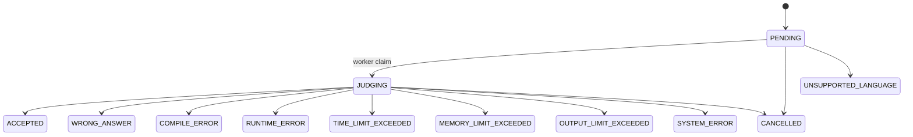

# Judge 状态模型

> 文档状态：当前实现
> 适用范围：Judge API / 前端状态展示 / 结果验收
> 最后更新：2026-06-26

## 1. 文档目的

本文档定义 OJOS 中提交和 case 结果的状态枚举。状态模型是 Judge API、数据库摘要、`result.json`、前端 `StatusTag` 和 E2E 验收之间的共同语言。任何新增状态都必须同时更新后端类型、worker result、前端展示和本文档。

## 2. 适用范围

本文档适用于维护 `services/judge-api`、`services/judge-worker`、`frontend/src/components/common/StatusTag.vue`、提交列表、提交详情和评测验收脚本的开发者。

## 3. 当前实现

当前状态覆盖排队、评测中、通过、答案错误、编译错误、运行错误、时间超限、内存超限、输出超限、系统错误、取消和不支持语言。前端必须展示全部状态，后端 public API 不返回内部日志路径，只返回摘要字段和受控日志内容。

## 4. 状态表

| 状态 | 含义 | 是否终态 | 用户错误 | 系统错误 | 是否计分 | 允许 rejudge | 前端颜色建议 | 典型产生原因 | 排查方式 |
| --- | --- | --- | --- | --- | --- | --- | --- | --- | --- |
| `PENDING` | 已提交，等待 worker claim | 否 | 否 | 否 | 否 | 是 | 默认 | 任务刚入队或等待 slot | 查看 `/admin/judge` queue 和 worker online 数 |
| `JUDGING` | 已被 worker claim，正在评测 | 否 | 否 | 否 | 否 | 是 | 处理中 | worker 正在编译或运行 case | 查看 task heartbeat、`lease_expires_at` |
| `ACCEPTED` | 所有必要 case 通过 | 是 | 否 | 否 | 是 | 是 | 成功 | 输出符合 checker | 查看 case 得分是否满分 |
| `WRONG_ANSWER` | 输出不符合答案或 checker 判错 | 是 | 是 | 否 | 是 | 是 | 警告 | 程序输出错误 | 管理员可看截断 checker log |
| `COMPILE_ERROR` | 编译失败 | 是 | 是 | 否 | 否 | 是 | 错误 | 语法错误、编译依赖缺失、编译命令失败 | 查看截断编译日志和语言配置 |
| `RUNTIME_ERROR` | 运行期异常 | 是 | 是 | 否 | 部分或否 | 是 | 错误 | 非零退出、崩溃、sandbox 拒绝 | 查看 exit code、stderr 摘要和 sandbox 日志 |
| `TIME_LIMIT_EXCEEDED` | 运行时间超过限制 | 是 | 是 | 否 | 部分或否 | 是 | 警告 | 无限循环、算法超时 | 检查 nsjail time limit 和外层 timeout |
| `MEMORY_LIMIT_EXCEEDED` | 内存超过限制 | 是 | 是 | 否 | 部分或否 | 是 | 警告 | 大数组、泄漏、Java/Python 内存过大 | 检查 cgroup `memory.events` 和 `memory.peak` |
| `OUTPUT_LIMIT_EXCEEDED` | stdout/stderr/checker log 超限 | 是 | 是 | 否 | 部分或否 | 是 | 警告 | 无限输出、大量错误日志 | 检查 `rlimit_fsize` 和输出文件大小 |
| `SYSTEM_ERROR` | 基础设施或评测系统错误 | 是 | 否 | 是 | 否 | 是 | 错误 | artifact 缺失、worker 环境损坏、落库失败 | 查看 Judge API 和 worker 日志 |
| `CANCELLED` | 提交被取消 | 是 | 否 | 否 | 否 | 是 | 默认 | 管理或用户取消 | 查看审计日志或取消来源 |
| `UNSUPPORTED_LANGUAGE` | 请求语言不支持或被禁用 | 是 | 是 | 否 | 否 | 是 | 错误 | language id 不存在或禁用 | 查看 `GET /api/judge/languages` |

## 5. 关键流程

## 6. 配置说明

语言启用状态来自 `services/judge-worker/config/languages.yaml` 和 Judge API 的语言列表。时间、内存、输出限制来自题目包、默认语言配置和 worker runtime 配置。

## 7. 安全边界

状态 API 可以返回 `message`、`score`、`time_ms`、`memory_kb`，但不能返回 `stdout_path`、`stderr_path`、`checker_log_path` 等内部路径。管理员调试也必须通过 API 返回截断文本。

## 8. 验收方式

运行 Linux E2E 用例，分别触发 AC/WA/CE/RE/TLE/MLE/OLE。Windows 静态验证只能证明类型和前端构建，不证明资源限制真实生效。

## 9. 常见问题

- MLE 被判成 RE：检查 cgroup v2 是否启用、`memory.events` 是否被读取。
- OLE 被判成 RE：检查输出限制是否映射到 `OUTPUT_LIMIT_EXCEEDED`。
- 长时间 `JUDGING`：检查 worker heartbeat 和 stale recovery。

## 10. 相关文档

- [资源限制](judge-resource-limits.md)
- [评测 E2E 用例](judge-e2e-cases.md)
- [Worker Link 协议](../architecture/worker-link-protocol.md)
