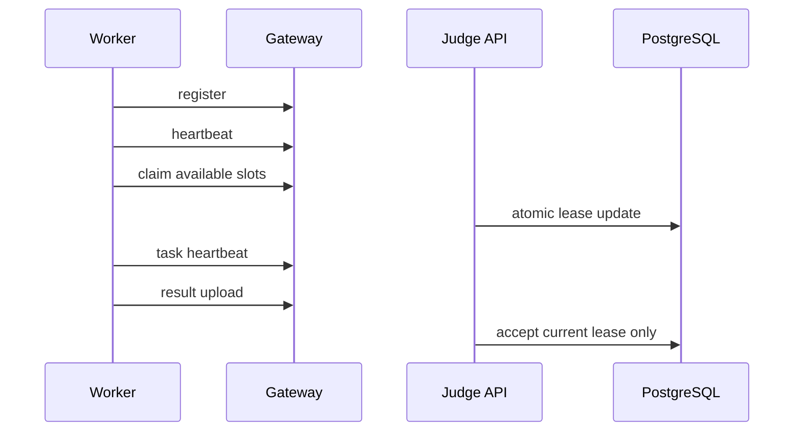

# Judge Worker 集群

> 文档状态：部分实现，本机双 worker 已验收，真实多机待验收
> 适用范围：Judge Worker 集群 / 运维 / E2E 验收
> 最后更新：2026-06-27

## 1. 文档目的

本文档说明多 worker 并发评测、task lease、stale recovery 和 admin 观测方式。

## 2. 适用范围

适用于部署多台 worker、维护 Judge API 调度逻辑和验收 worker crash recovery 的人员。

## 3. 当前实现

worker 通过 Worker Link 注册、心跳、claim、下载 artifact、上传 result。PostgreSQL `judge_tasks` 是事实源，Redis Streams 是 signal history。

## 4. 目标设计

多 worker 应横向扩展，总并发由各 worker `OJOS_MAX_CONCURRENCY` 相加。后续可增加优先级和 contest queue 隔离。

## 5. 关键流程

## 6. 配置说明

关键配置包括 worker id、worker token、max concurrency、heartbeat interval、task lease TTL 和 supported languages。

## 7. 安全边界

worker 不直连 DB/Redis，不挂载 storage。旧 lease result 必须拒绝。

## 8. 验收方式

启动两个 worker，每个并发为 1，提交多份任务，确认没有重复评测；停掉一个 worker，任务能恢复。

## 9. 2026-06-27 验收结果

已在 `Ubuntu-24.04-OJOS` WSL2 Linux 环境执行本机双 worker 验收：

| 检查 | 结果 |
| --- | --- |
| worker 数量 | `docker compose --scale judge-worker=2` |
| worker 注册 | 两个 worker 均 ONLINE |
| worker_id | 未发现冲突 |
| 任务分布 | 四语言矩阵任务分布到 2 个 worker |
| 重复 claim | 未发现同一任务被重复占有 |
| Admin Judge workers | 可看到两个 worker |
| Admin Judge tasks | 可看到 task 与 `lease_version` |
| crash recovery | worker A 停止后任务由 worker B 恢复 |
| stale result | 旧 lease result HTTP 400 拒绝 |
| 最终结果 | 未被旧 worker 覆盖 |

本次仅证明本机 Linux 双 worker 模拟通过；没有第二台真实机器参与，不能声明真实多机 worker node 已通过。

## 10. 常见问题

- 单 worker 抢光任务：检查 claim 数量是否受 available slots 限制。
- 永久 JUDGING：检查 stale recovery。
- 旧结果覆盖：检查 `lease_version`。
- 两个 worker 使用同一 `worker_id`：检查 worker ID 生成和 compose service/hostname 配置。

## 11. 相关文档

- [Worker Link 协议](../architecture/worker-link-protocol.md)
- [Linux 运行验收](../e2e/e2e-linux-runtime.md)
