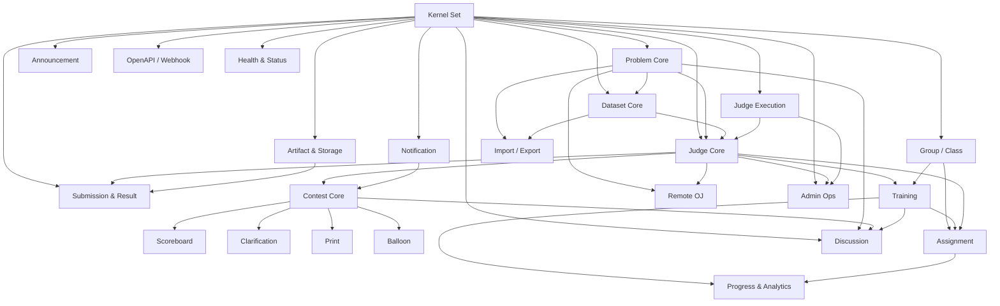
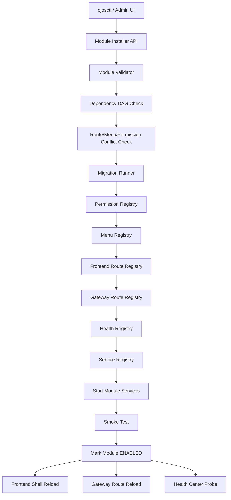
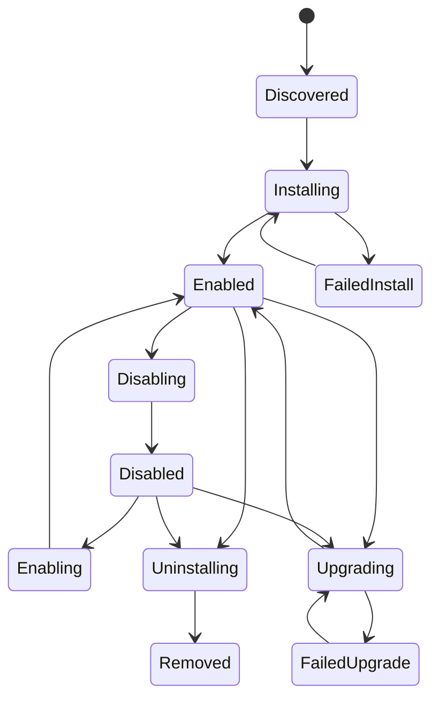
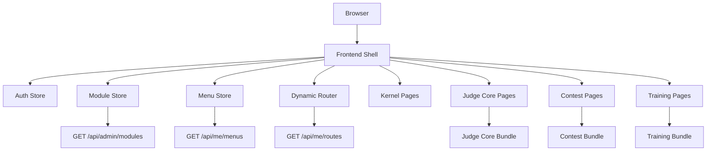
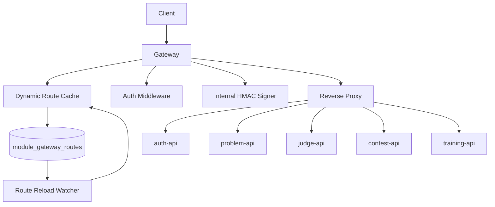

# OJOS 模�拓扑设计

> 文档状�：部分��
> 适用范围：��设�/ 模�系统规划
> 最�更新：2026-06-26

本文档定�OJOS �Service �Module �Set �OJOS 拓扑。当�仓库已���Core Judge Platform 的主体链路，并新�Module Registry v0：数�库�表�Set�Module�Dependency�Component�Installation，Gateway �供�读 admin modules API，�端��`/admin/modules` �`/admin/modules/topology`。本文中�Installer�动�安装�Contest 热�拔等内容���目标��。没有�际代�和验收记录支撑的内容，�应�解为已�上线�
## 当���补充：Module Registry v0

当�已��内容：

- 新� `deploy/migrations/000009_module_registry.up.sql` �down migration�- 新� `modules/judge-core/module.yaml`，把�有 Judge Core 登记�builtin module�- Gateway �动时幂�bootstrap Kernel 内置模��`ojos.judge-core`�- �供 `GET /api/admin/modules`�`GET /api/admin/modules/sets`�`GET /api/admin/modules/topology`�`GET /api/admin/modules/:id`�- �端�供 `/admin/modules`�`/admin/modules/topology`�`/admin/modules/:id`�- `/api/admin/modules/topology` 必须返��空 `sets`�`nodes`�`edges` �`components`。其�`nodes` 至少包�五个 Kernel 模��`ojos.judge-core`，`components` 至少包� `problem-api`�`judge-api`�`judge-worker`�`frontend-routes`�`gateway-routes` �`permissions`�- Gateway 路由�`/api/admin/modules/topology` 必须�在 `/api/admin/modules/:id` 之�，��`topology` 被当�模�id�
当�未��内容：

- �支�install�enable�disable�upgrade�uninstall�- 未开�B Contest 主体开��- `ojos.judge-core` �是 builtin module，�是通过 installer 安装的模��- A/Judge Core �未完� Docker daemon�Linux nsjail/cgroup�多�worker 真��行验收，�能标记为 GA�
## 1. 文档目标

本文档用�定�OJOS 的模�化拓扑��。OJOS 的目标�是�一在线评测系统，而是一个�以按需安装��用��用��级��载模�的 OJ Operating System�

系统最终应支��

* 基础内核稳定�行�
* 业务模�按集�组织�
* �个模�由多个微�务��端页����点�数�库�移�����康检查和部署片段组��
* 模�之间通过显��赖关系���
* 安装器能够根�模�拓扑自动判断安装顺���载影�范围��级�险�
* �端��能够以拓扑图形�展示整个 OJOS 的模�状��
* 评测节点�以作为外部 Worker 模�横�扩展，支�多机并�评测�
* A 模�完整上线�，�通过安装器追�B�C�D 等模��

本文档定义四层结�：

```text
Service 微��
    �
Module 模�
    �
Set 集�
    �
OJOS 整体系统
```

---

## 2. 核心概念

### 2.1 Service：微�务

Service 是一个�责相对独立��以�独�行��独扩容��独观测的进程或�务�元�

示例�

```text
gateway
auth-api
permission-api
problem-api
dataset-api
submission-api
judge-api
worker-link-api
judge-worker
contest-api
scoreboard-api
training-api
notification-api
module-registry-api
module-installer-api
health-api
```

Service �等�� Module。一�Module �以包�多个 Service�

---

### 2.2 Module：模�

Module 是一个完整业务能力�元，由以下内容组�：

```text
�端�务
�端页�
���
��
�端路由
Gateway 路由
数�库��
�置�
Worker 定义
存储桶定�
�康检�
审计�
部署片段
验收脚本
文档
```

示例�

```text
Judge Core Module
Contest Module
Training Module
Discussion Module
Remote OJ Module
Module Runtime Module
```

模�是安装器处�的最�业务���

---

### 2.3 Set：集�

Set 是若干相关模�组�的能力域�

示例�

```text
Kernel Set
Core Capability Set
Competition Set
Education Set
Collaboration Set
Integration Set
Operations Set
```

集�主�用��

* 规划安装包�
* �制开�阶段�
* 展示模�拓扑�
* 定义��安装组��

---

### 2.4 OJOS

OJOS 是所�Set�Module�Service�基础设施共�组�的完整系统�

OJOS 的目标是�

```text
Kernel 固定稳定
Core 能力完整上线
业务扩展模�热��
安装器统一管� ABC... 模�
```

---

## 3. 总体拓扑

```mermaid
flowchart TB
    OJOS[OJOS / OJ Operating System]

    OJOS --> KERNEL[Set 0: Kernel Set]
    OJOS --> CORE[Set 1: Core Capability Set]
    OJOS --> COMPETITION[Set 2: Competition Set]
    OJOS --> EDUCATION[Set 3: Education Set]
    OJOS --> COLLAB[Set 4: Collaboration Set]
    OJOS --> INTEGRATION[Set 5: Integration Set]
    OJOS --> OPS[Set 6: Operations Set]

    KERNEL --> K1[Edge & UI Shell Module]
    KERNEL --> K2[Identity & Access Module]
    KERNEL --> K3[Module Runtime Module]
    KERNEL --> K4[Config & Secret Module]
    KERNEL --> K5[Audit & Policy Module]

    CORE --> C1[Problem Core Module]
    CORE --> C2[Dataset Core Module]
    CORE --> C3[Judge Core Module]
    CORE --> C4[Submission & Result Module]
    CORE --> C5[Artifact & Storage Module]
    CORE --> C6[Judge Execution Module]

    COMPETITION --> B1[Contest Core Module]
    COMPETITION --> B2[Scoreboard Module]
    COMPETITION --> B3[Clarification Module]
    COMPETITION --> B4[Print Module]
    COMPETITION --> B5[Balloon Module]

    EDUCATION --> E1[Group / Class Module]
    EDUCATION --> E2[Training Module]
    EDUCATION --> E3[Assignment Module]
    EDUCATION --> E4[Progress & Analytics Module]

    COLLAB --> L1[Notification Module]
    COLLAB --> L2[Discussion Module]
    COLLAB --> L3[Announcement Module]

    INTEGRATION --> I1[Remote OJ Module]
    INTEGRATION --> I2[OpenAPI / Webhook Module]
    INTEGRATION --> I3[Import / Export Module]

    OPS --> O1[Admin Ops Module]
    OPS --> O2[Health & Status Module]
    OPS --> O3[Observability Module]
    OPS --> O4[Backup & Retention Module]
```



---

## 4. Set 分组设计

### 4.1 Set 0：Kernel Set

Kernel Set �OJOS 的内核集�，�建议作为普通热�拔模�频��载�

Kernel Set �供�

* 用户认��
* ��系统�
* Gateway 统一入��
* 模�注册�
* 模�安装�
* �端壳�
* 动����
* 动�路由�
* �置中心�
* 内部�务认��
* 审计�
* �康检查基础设施�

包�模��

| 模�                | 说�                         | 热�拔等�    |
| ----------------- | -------------------------- | --------- |
| Edge & UI Shell   | Gateway�Frontend Shell�BFF | Kernel 固定 |
| Identity & Access | Auth�Permission�User�Role  | Kernel 固定 |
| Module Runtime    | 模�注册�安装�生命周�              | Kernel 固定 |
| Config & Secret   | �置�密钥�内�HMAC              | Kernel 固定 |
| Audit & Policy    | 审计�策略检�                   | 谨�热��    |

---

### 4.2 Set 1：Core Capability Set

Core Capability Set �A 集�，是最先��到�上线的核心 OJ 能力�

包�模��

| 模�                  | 说�                        | 热�拔等�     |
| ------------------- | ------------------------- | ---------- |
| Problem Core        | 题目元信��题��CRUD             | 谨�热��     |
| Dataset Core        | 题目包�测试数��验�              | 谨�热��     |
| Judge Core          | �交�调度�Worker Link         | 谨�热��     |
| Submission & Result | �交结��case 详情�调试日�        | 谨�热��     |
| Artifact & Storage  | ���题目包�结�产物访�            | 谨�热��     |
| Judge Execution     | judge-worker�sandbox�资���| Worker 热��|

Core Capability Set 完��，系统应具备一个完整上线级 OJ 的能力�

---

### 4.3 Set 2：Competition Set

Competition Set �B 集�，用�比赛能力�

包�模��

| 模�            | 说�           | 热�拔等�|
| ------------- | ------------ | ----- |
| Contest Core  | 比赛创建�报��题目��| 适�热��|
| Scoreboard    | 榜���榜�滚�    | 适�热��|
| Clarification | 比赛�问���     | 适�热��|
| Print         | 打��务         | 适�热��|
| Balloon       | 气�派�         | 适�热��|

Competition Set �赖 Core Capability Set�

---

### 4.4 Set 3：Education Set

Education Set 用�教学�训练�作业��级场景�

包�模��

| 模�                   | 说�         | 热�拔等�|
| -------------------- | ---------- | ----- |
| Group / Class        | 组织��级���  | 谨�热��|
| Training             | 题��训练计�   | 适�热��|
| Assignment           | 作业�截止时间���| 适�热��|
| Progress & Analytics | 学习进度�统计分� | 适�热��|

---

### 4.5 Set 4：Collaboration Set

Collaboration Set 用�站内�作和信���

包�模��

| 模�           | 说�        | 热�拔等�|
| ------------ | --------- | ----- |
| Notification | 站内通知�消�派�| 适�热��|
| Discussion   | 讨论�评论�题� | 适�热��|
| Announcement | 公告�活动消�  | 适�热��|

---

### 4.6 Set 5：Integration Set

Integration Set 用�外部系统�入�

包�模��

| 模�                | 说�               | 热�拔等�|
| ----------------- | ---------------- | ----- |
| Remote OJ         | 外部 OJ 抓题��步�远程��| 适�热��|
| OpenAPI / Webhook | 开�API�Webhook   | 适�热��|
| Import / Export   | 数�导入导出           | 适�热��|

---

### 4.7 Set 6：Operations Set

Operations Set 用�上线�的�维能力�

包�模��

| 模�                 | 说�         | 热�拔等� |
| ------------------ | ---------- | ------ |
| Admin Ops          | ���维�作     | 谨�热�� |
| Health & Status    | �康检查�状�页   | 谨�热�� |
| Observability      | 指标�日志�链路追�| 适�外部集� |
| Backup & Retention | 备份�����留策�| 谨�热�� |

---

## 5. 微�务总清�

### 5.1 Kernel Set 微��

#### Edge & UI Shell Module

| �务�           | 类�           | �责                          |
| -------------- | ------------ | --------------------------- |
| gateway        | HTTP Gateway | 统一入����代��JWT 解��内�HMAC 签� |
| frontend-shell | Frontend     | 主�端壳�动����动�路�             |
| public-bff     | HTTP API，�� | ������                      |
| admin-bff      | HTTP API，�� | ������                      |

#### Identity & Access Module

| �务�             | 类�       | �责                  |
| ---------------- | -------- | ------------------- |
| auth-api         | HTTP API | 注册�登录�profile�token |
| permission-api   | HTTP API | ��点�角色�用户角色�资�级��   |
| policy-evaluator | 内部组件     | ��判断核心              |
| user-api         | HTTP API | 用户列表�用户资料�用户管�     |
| audit-log-api    | HTTP API | ���更和�感�作审�        |

#### Module Runtime Module

| �务�                        | 类�       | �责             |
| --------------------------- | -------- | -------------- |
| module-registry-api         | HTTP API | 模�注册�查询�拓�    |
| module-installer-api        | HTTP API | 安装��用��用��级���|
| module-lifecycle-controller | ���制�   | 执行生命周期动作       |
| route-menu-registry-api     | 内部 API   | 动����动��端路�   |
| health-registry-api         | 内部 API   | 模��康检查注�      |

#### Config & Secret Module

| �务�                      | 类�         | �责               |
| ------------------------- | ---------- | ---------------- |
| config-api                | HTTP API   | 平��置�模���       |
| secret-api                | HTTP API   | 密钥元数�管�         |
| secret-rotation-worker    | Worker     | 密钥轮�             |
| internal-auth-key-manager | Worker/API | 内部�务 HMAC key 管� |

#### Audit & Policy Module

| �务�                   | 类�       | �责        |
| ---------------------- | -------- | --------- |
| audit-api              | HTTP API | 审计日志查询    |
| policy-check-api       | HTTP API | 策略检�     |
| audit-retention-worker | Worker   | 审计日志归档�清�|

---

### 5.2 Core Capability Set 微��

#### Problem Core Module

| �务�                 | 类�          | �责             |
| -------------------- | ----------- | -------------- |
| problem-api          | HTTP API    | 题目 CRUD�题��元信� |
| problem-public-api   | HTTP API，��| ��题目�读��       |
| problem-admin-api    | HTTP API，��| ��题目管���       |
| problem-index-worker | Worker，��  | �索索引�标签统�     |

#### Dataset Core Module

| �务�                         | 类�       | �责            |
| ---------------------------- | -------- | ------------- |
| dataset-api                  | HTTP API | 题目包�测试数��版本管�|
| package-validator-worker     | Worker   | 题目包格�验�      |
| package-build-worker         | Worker   | 题目包�建��布�生�  |
| dataset-import-export-worker | Worker   | 数�集导入导�      |

#### Judge Core Module

| �务�                  | 类�                | �责                       |
| --------------------- | ----------------- | ------------------------ |
| submission-api        | HTTP API          | 创建�交��消�交���            |
| submission-query-api  | HTTP API          | �交列表��交详�               |
| judge-control-api     | HTTP API          | 管�员评测�制�requeue�drain    |
| worker-link-api       | HTTP API          | Worker 注册�心跳�claim�上�   |
| judge-dispatcher      | Worker/Controller | 任务调度�分��队列维�            |
| judge-recovery-worker | Worker            | 过期 lease ���失�worker 处� |

#### Submission & Result Module

| �务�                    | 类�       | �责                         |
| ----------------------- | -------- | -------------------------- |
| result-api              | HTTP API | 结�查询�case 结��debug 日志      |
| result-aggregator       | Worker   | �� case 结��submission 总结�|
| result-retention-worker | Worker   | 结��留�清�                   |

#### Artifact & Storage Module

| �务�                      | 类�       | �责               |
| ------------------------- | -------- | ---------------- |
| artifact-api              | HTTP API | ���题目包�结�产物访�   |
| artifact-upload-api       | HTTP API | Worker 上传结��日�  |
| artifact-retention-worker | Worker   | 产物清�             |
| artifact-digest-worker    | Worker   | 产物 hash 校验�完整性检�|

#### Judge Execution Module

| �务�                     | 类�     | �责                    |
| ------------------------ | ------ | --------------------- |
| judge-worker             | Worker | 编译��行�判题�上传结�        |
| sandbox-runner           | 内部组件   | nsjail + cgroup v2 执行 |
| resource-meter           | 内部组件   | time/memory/output 采集 |
| language-runtime-manager | 内部组件   | 语言�行模�管�              |

---

### 5.3 Competition Set 微��

#### Contest Core Module

| �务�                    | 类�       | �责              |
| ----------------------- | -------- | --------------- |
| contest-api             | HTTP API | 比赛 CRUD�报���赛��|
| contest-problem-api     | HTTP API | 比赛题目�置          |
| contest-submission-api  | HTTP API | 比赛�交入�          |
| contest-schedule-worker | Worker   | 自动开始�结���榜触�   |
| contest-access-worker   | Worker   | 访问�制状�刷�       |

#### Scoreboard Module

| �务�                      | 类�       | �责           |
| ------------------------- | -------- | ------------ |
| scoreboard-api            | HTTP API | 榜�查询         |
| scoreboard-stream-worker  | Worker   | �时榜�更新       |
| scoreboard-rebuild-worker | Worker   | 全��建榜�       |
| scoreboard-freeze-worker  | Worker   | �榜�解榜�滚榜状�处�|

#### Clarification Module

| �务�                        | 类�       | �责         |
| --------------------------- | -------- | ---------- |
| clarification-api           | HTTP API | �问����公开�� |
| clarification-notify-worker | Worker   | �醒�赛者和管�� |

#### Print Module

| �务�                 | 类�             | �责        |
| -------------------- | -------------- | --------- |
| print-api            | HTTP API       | 打�请求�交�审�|
| print-queue-worker   | Worker         | 打�队列处�    |
| print-device-adapter | Worker/Adapter | 打�机适�     |

#### Balloon Module

| �务�                    | 类�       | �责       |
| ----------------------- | -------- | -------- |
| balloon-api             | HTTP API | 气�任务管�   |
| balloon-dispatch-worker | Worker   | 气�派�状���|

---

### 5.4 Education Set 微��

#### Group / Class Module

| �务�                     | 类�       | �责       |
| ------------------------ | -------- | -------- |
| group-api                | HTTP API | 组织��级�团�|
| membership-api           | HTTP API | �员管�     |
| membership-import-worker | Worker   | �员批�导入   |

#### Training Module

| �务�                  | 类�       | �责      |
| --------------------- | -------- | ------- |
| training-api          | HTTP API | 题��训练计�|
| training-progress-api | HTTP API | 训练进度    |
| training-sync-worker  | Worker   | 训练统计刷新  |

#### Assignment Module

| �务�                        | 类�       | �责        |
| --------------------------- | -------- | --------- |
| assignment-api              | HTTP API | 作业创建��交规�|
| assignment-grade-api        | HTTP API | �绩查询      |
| assignment-evaluator-worker | Worker   | 作业�绩��    |

#### Progress & Analytics Module

| �务�                    | 类�       | �责   |
| ----------------------- | -------- | ---- |
| progress-api            | HTTP API | 用户进度 |
| analytics-api           | HTTP API | 统计分� |
| analytics-rollup-worker | Worker   | 周期�� |

---

### 5.5 Collaboration Set 微��

#### Notification Module

| �务�                         | 类�          | �责        |
| ---------------------------- | ----------- | --------- |
| notification-api             | HTTP API    | 通知查询�标记已�|
| notification-delivery-worker | Worker      | 通知派�      |
| notification-template-api    | HTTP API，��| 模�管�      |

#### Discussion Module

| �务�                    | 类�       | �责        |
| ----------------------- | -------- | --------- |
| discussion-api          | HTTP API | 讨论�评论�题� |
| moderation-worker       | Worker   | 举报处��内容审�|
| discussion-index-worker | Worker   | �索索引      |

#### Announcement Module

| �务�                        | 类�       | �责   |
| --------------------------- | -------- | ---- |
| announcement-api            | HTTP API | 公告管� |
| announcement-publish-worker | Worker   | 定时�布 |

---

### 5.6 Integration Set 微��

#### Remote OJ Module

| �务�                       | 类�           | �责                        |
| -------------------------- | ------------ | ------------------------- |
| remote-oj-api              | HTTP API     | 远程 OJ �置�账�绑�            |
| remote-problem-sync-worker | Worker       | 远程题目�步                    |
| remote-submit-worker       | Worker       | 远程�交                      |
| remote-result-sync-worker  | Worker       | 远程结��步                    |
| remote-oj-adapter-host     | Adapter Host | Codeforces�AtCoder�洛谷等适��|

#### OpenAPI / Webhook Module

| �务�                    | 类�       | �责            |
| ----------------------- | -------- | ------------- |
| openapi-gateway         | HTTP API | 外部开放��       |
| webhook-api             | HTTP API | Webhook 注册    |
| webhook-delivery-worker | Worker   | Webhook 投递��试 |

#### Import / Export Module

| �务�              | 类�       | �责       |
| ----------------- | -------- | -------- |
| import-export-api | HTTP API | 导入导出任务管� |
| import-worker     | Worker   | 执行导入     |
| export-worker     | Worker   | 执行导出     |

---

### 5.7 Operations Set 微��

#### Admin Ops Module

| �务�             | 类�       | �责                      |
| ---------------- | -------- | ----------------------- |
| admin-ops-api    | HTTP API | ���维�作                  |
| queue-admin-api  | HTTP API | 队列查看��试�清�             |
| worker-admin-api | HTTP API | Worker 状��drain�disable |

#### Health & Status Module

| �务�                | 类�       | �责     |
| ------------------- | -------- | ------ |
| health-api          | HTTP API | �务�康检�|
| status-page-api     | HTTP API | 状�页    |
| health-probe-worker | Worker   | 周期�测   |

#### Observability Module

| �务�             | 类�      | �责              |
| ---------------- | ------- | --------------- |
| metrics-exporter | Service | Prometheus 指标导出 |
| trace-collector  | Service | 链路追踪采集          |
| log-ingest       | Service | 日志采集            |

#### Backup & Retention Module

| �务�              | 类�       | �责      |
| ----------------- | -------- | ------- |
| backup-controller | Worker   | 备份任务    |
| retention-worker  | Worker   | 数��留�清�|
| restore-api       | HTTP API | ���作入�  |

---

## 6. 模��赖拓扑



---

## 7. 热�拔分�

### 7.1 L1：UI 热��

�以热�拔：

```text
��
�端路由
�端页�
模�入�
状�页入�
```

特点�

* �险��
* �以�行时刷新�
* �用模����和页�立����

---

### 7.2 L2：API 热��

�以热�拔：

```text
Gateway route
模��端 API
模� BFF
Webhook endpoint
OpenAPI endpoint
```

�求�

* Gateway 动�路由必�fail-closed�
* 模��用�API 返� 404 �503�
* ��许�用��然能访问�端�务�

---

### 7.3 L3：Worker 热��

�以热�拔：

```text
judge-worker node
remote-oj-worker
scoreboard-worker
notification-worker
import/export-worker
```

�求�

* Worker 必须注册�
* Worker 必须 heartbeat�
* Worker 必须�lease�
* Worker 下线�任务����
* ��许任务永久�死�
* ��许旧 lease 覆盖新结��

---

### 7.4 L4：Data 热��

谨�热�拔：

```text
数�库��
存储�
索引
事件 topic
队列�
```

�求�

* 必须�migration�
* 必须�rollback �disable 策略�
* 默认�载�删数��
* 数�删除必须显��险确认�

---

### 7.5 L5：Kernel �级

�建议普通热�拔�

```text
Gateway
Auth
Permission
Module Registry
Installer
Config
Secret
JWT key
HMAC key ring
```

�求�

* 需�维护窗��
* 需��级计划�
* 需�备份�
* 需��滚策略�

---

## 8. Module Runtime 拓扑



模�安装�是�制文件，而是完整生命周期�

```text
validate
dependency check
conflict check
migration
permission registration
menu registration
frontend route registration
gateway route registration
health registration
service registration
start service
smoke test
enable
```

任何一步失败必须进入失败状�，并输出安装报告�

---

## 9. 模�状�机



模�状�：

```text
DISCOVERED
INSTALLING
ENABLED
DISABLING
DISABLED
ENABLING
UPGRADING
FAILED_INSTALL
FAILED_UPGRADE
UNINSTALLING
REMOVED
```

---

## 10. 模�数�模�设计

### 10.1 module_sets

```sql
CREATE TABLE module_sets (
    id BIGSERIAL PRIMARY KEY,
    set_id TEXT NOT NULL UNIQUE,
    name TEXT NOT NULL,
    description TEXT NOT NULL DEFAULT '',
    sort_order INT NOT NULL DEFAULT 0,
    created_at TIMESTAMPTZ NOT NULL DEFAULT NOW()
);
```

---

### 10.2 module_nodes

```sql
CREATE TABLE module_nodes (
    id BIGSERIAL PRIMARY KEY,
    module_id TEXT NOT NULL UNIQUE,
    set_id TEXT NOT NULL,
    name TEXT NOT NULL,
    version TEXT NOT NULL,
    status TEXT NOT NULL,
    kind TEXT NOT NULL,
    manifest JSONB NOT NULL,
    created_at TIMESTAMPTZ NOT NULL DEFAULT NOW(),
    updated_at TIMESTAMPTZ NOT NULL DEFAULT NOW()
);
```

`kind` �选值：

```text
kernel
feature
worker
integration
ops
theme
```

---

### 10.3 module_edges

```sql
CREATE TABLE module_edges (
    id BIGSERIAL PRIMARY KEY,
    from_module_id TEXT NOT NULL,
    to_module_id TEXT NOT NULL,
    edge_type TEXT NOT NULL,
    version_constraint TEXT NOT NULL DEFAULT '',
    required BOOLEAN NOT NULL DEFAULT TRUE,
    created_at TIMESTAMPTZ NOT NULL DEFAULT NOW(),
    UNIQUE(from_module_id, to_module_id, edge_type)
);
```

`edge_type` �选值：

```text
depends_on
extends
provides_service_to
uses_permission_from
uses_storage_from
uses_event_from
```

---

### 10.4 module_components

```sql
CREATE TABLE module_components (
    id BIGSERIAL PRIMARY KEY,
    module_id TEXT NOT NULL,
    component_id TEXT NOT NULL,
    component_type TEXT NOT NULL,
    status TEXT NOT NULL,
    config JSONB NOT NULL DEFAULT '{}',
    created_at TIMESTAMPTZ NOT NULL DEFAULT NOW(),
    updated_at TIMESTAMPTZ NOT NULL DEFAULT NOW(),
    UNIQUE(module_id, component_id)
);
```

`component_type` �选值：

```text
backend_service
frontend_bundle
worker_service
migration
permission_set
menu_set
gateway_route_set
health_check
storage_bucket
event_topic
config_schema
```

---

### 10.5 module_installations

```sql
CREATE TABLE module_installations (
    id BIGSERIAL PRIMARY KEY,
    module_id TEXT NOT NULL UNIQUE,
    name TEXT NOT NULL,
    version TEXT NOT NULL,
    status TEXT NOT NULL,
    manifest JSONB NOT NULL,
    installed_at TIMESTAMPTZ NOT NULL DEFAULT NOW(),
    updated_at TIMESTAMPTZ NOT NULL DEFAULT NOW(),
    enabled_at TIMESTAMPTZ,
    disabled_at TIMESTAMPTZ
);
```

---

### 10.6 module_migrations

```sql
CREATE TABLE module_migrations (
    id BIGSERIAL PRIMARY KEY,
    module_id TEXT NOT NULL,
    version TEXT NOT NULL,
    migration_name TEXT NOT NULL,
    checksum TEXT NOT NULL,
    applied_at TIMESTAMPTZ NOT NULL DEFAULT NOW(),
    UNIQUE(module_id, migration_name)
);
```

---

### 10.7 module_permissions

```sql
CREATE TABLE module_permissions (
    id BIGSERIAL PRIMARY KEY,
    module_id TEXT NOT NULL,
    permission_key TEXT NOT NULL UNIQUE,
    description TEXT NOT NULL DEFAULT '',
    created_at TIMESTAMPTZ NOT NULL DEFAULT NOW()
);
```

---

### 10.8 module_menus

```sql
CREATE TABLE module_menus (
    id BIGSERIAL PRIMARY KEY,
    module_id TEXT NOT NULL,
    menu_key TEXT NOT NULL UNIQUE,
    title TEXT NOT NULL,
    route_path TEXT NOT NULL,
    icon TEXT NOT NULL DEFAULT '',
    parent_key TEXT NOT NULL DEFAULT '',
    sort_order INT NOT NULL DEFAULT 0,
    required_permission TEXT NOT NULL DEFAULT '',
    enabled BOOLEAN NOT NULL DEFAULT TRUE
);
```

---

### 10.9 module_frontend_routes

```sql
CREATE TABLE module_frontend_routes (
    id BIGSERIAL PRIMARY KEY,
    module_id TEXT NOT NULL,
    route_path TEXT NOT NULL,
    route_name TEXT NOT NULL,
    component_key TEXT NOT NULL,
    required_permission TEXT NOT NULL DEFAULT '',
    enabled BOOLEAN NOT NULL DEFAULT TRUE,
    created_at TIMESTAMPTZ NOT NULL DEFAULT NOW(),
    UNIQUE(module_id, route_path)
);
```

---

### 10.10 module_gateway_routes

```sql
CREATE TABLE module_gateway_routes (
    id BIGSERIAL PRIMARY KEY,
    module_id TEXT NOT NULL,
    prefix TEXT NOT NULL UNIQUE,
    target_service TEXT NOT NULL,
    auth_mode TEXT NOT NULL,
    enabled BOOLEAN NOT NULL DEFAULT TRUE
);
```

---

## 11. Module Manifest 规范

�个模�必须�供 `module.yaml`�

当���示例：Judge Core builtin module。该示例对应 `modules/judge-core/module.yaml` �Module Registry v0 �bootstrap 数�，��键必须�`deploy/migrations/000003_permission_core.up.sql` 以��有业务逻辑一致�
```yaml
id: ojos.judge-core
name: Judge Core
version: 0.1.0
set: core-capability
kind: feature
status: builtin
description: 题目�题目包��交�评测�Worker Link�结�查询�评测集群管�模��
requires:
  platform: ">=0.1.0"
  modules:
    - ojos.platform.web-shell >= 0.1.0
    - ojos.platform.identity-access >= 0.1.0
    - ojos.kernel.config >= 0.1.0

provides:
  permissions:
    - problem.view
    - problem.view.private
    - problem.create
    - problem.edit
    - problem.delete
    - problem.manage.data
    - problem.manage.asset
    - judge.submit
    - submission.view.own
    - submission.view.all

  backend_services:
    - id: problem-api
      path: services/problem-api
      health: /health
      exposure: internal

    - id: judge-api
      path: services/judge-api
      health: /health
      exposure: internal

  worker_services:
    - id: judge-worker
      path: services/judge-worker
      mode: external-node

  frontend:
    routes:
      - /problems
      - /submissions
      - /admin/judge

  gateway_routes:
    - prefix: /api/problem
      service: problem-api
      auth: user

    - prefix: /api/judge
      service: judge-api
      auth: user

    - prefix: /api/judge/worker
      service: judge-api
      auth: worker

  migrations:
    - deploy/migrations/000002_judge_schema.up.sql
    - deploy/migrations/000004_problem_package_core.up.sql
    - deploy/migrations/000008_worker_link.up.sql

  storage:
    buckets:
      - problems
      - submissions
      - judge-artifacts

  health_checks:
    - id: problem-api
    - id: judge-api
    - id: worker-cluster
    - id: queue
    - id: artifact-storage

lifecycle:
  note: 当�阶段�登�builtin module，�执行 install / disable / uninstall�```

---

## 12. �端拓扑设计

### 12.1 Frontend Shell

Frontend Shell 负责�

```text
登录�
路由守�
��守�
动���
动�路�
模�页�加载
全局错误�
主题
布局
```

### 12.2 �端拓扑



### 12.3 �端热�拔阶�

分阶段��：

```text
Phase 1：�建期集� + 动���
Phase 2：模�manifest �+ ��/路由动�化
Phase 3：Installer 管�模��用/�用
Phase 4：�行时 remote frontend bundle
```

早期�建议直�上 remote frontend bundle。先使用�建期集�，����度�

---

## 13. Gateway 动�路由设�

Gateway 长期�应写死模�路由�

### 13.1 目标

```text
模�安装�注�route
模��用�Gateway 加载 route
模��用�Gateway 关闭 route
模��载�route 删除或标�disabled
```

### 13.2 拓扑



### 13.3 Fail-Closed 规则

Gateway 必须�守�

```text
没有匹� route�04
模� disabled�04 �503
内部签�失败�02/500，�继续转�
target service ��康：503
auth_mode �匹�：401/403
```

---

## 14. 安装器设�

安装器命�：

```text
ojosctl
```

### 14.1 命令

```bash
ojosctl module list
ojosctl module topology
ojosctl module inspect ./modules/judge-core
ojosctl module validate ./modules/judge-core
ojosctl module install ./modules/judge-core
ojosctl module enable ojos.judge-core
ojosctl module disable ojos.judge-core
ojosctl module upgrade ojos.judge-core
ojosctl module uninstall ojos.judge-core
ojosctl module doctor ojos.judge-core
ojosctl module package ./modules/contest
ojosctl module verify contest.ojosmod
```

---

### 14.2 安装�程

```text
1. 读� module.yaml
2. 校验 manifest
3. 校验平�版本
4. 校验�赖模�
5. 检测�赖�
6. 拓扑��
7. 检�route/menu/permission/service 冲�
8. 备份当� module registry
9. 执行数�库��
10. 注册���
11. 注册��
12. 注册�端路由
13. 注册 Gateway route
14. 注册 health check
15. 注册 service
16. 写入 module_installations
17. �动模��务
18. Gateway reload
19. Frontend Shell reload
20. 执行 smoke test
21. 标记 ENABLED
22. 输出安装报告
```

---

### 14.3 �用�程

```text
1. 检查是�有其他 enabled 模��赖当�模�
2. 有�赖则拒�或�求级���
3. 执行 pre_disable
4. �止�收新请�
5. Gateway route disabled
6. Frontend menu disabled
7. Frontend route disabled
8. Worker drain
9. Health check disabled
10. 标记 DISABLED
11. 执行 post_disable
```

---

### 14.4 �载�程

默认策略�

```text
disable_only
```

�载�默认删除数��

�选策略：

```text
disable_only
remove_code_keep_data
remove_code_and_data
```

�险�作必须显�确认�

---

## 15. A/B/C 集�路线

### 15.1 A：Core Judge Platform

A 是第一个完整上线集��

包��

```text
Kernel 最�能�
Problem Core
Dataset Core
Judge Core
Submission & Result
Artifact & Storage
Judge Execution
Admin Ops 最�能�
Health & Status 最�能�
```

完�标准�

```text
用户能注册�登录�看题��交�看结�
管�员能创建题�校验题目包�管����看 worker�看�康状�
多� worker 能并�评�
资��制�用
四语言验收通过
E2E 文档和脚本完�
Public API �泄露内部路�
```

---

### 15.2 B：Competition Platform

B 是第一个通过安装器追加的集��

包��

```text
Contest Core
Scoreboard
Clarification
Print
Balloon
Notification
```

�赖�

```text
Kernel
Problem Core
Judge Core
Submission & Result
```

完�标准�

```text
安装�没�contest ���API
安装�自动出�contest ���API
管�员能创建比赛
用户能报�和�交
Scoreboard 正确
�用 B ���和 API 消失
A ��影�
```

---

### 15.3 C：Education Platform

包��

```text
Group / Class
Training
Assignment
Progress & Analytics
Notification
```

�赖�

```text
Kernel
Problem Core
Judge Core
Submission & Result
```

完�标准�

```text
教师能创建��
教师能布置训练和作业
学生能完�作�
系统能统计进度和�绩
�用 C ��影� A/B
```

---

## 16. 开�阶段规�

### Phase 1：A 集�上线收�

目标：当�已�Judge Core 系统达到�上线级�

任务�

```text
修��建/格�/警告
清�旧文�
补� Admin Health
补� Admin Users
补� Admin Permissions
补� Permission Check
补���管��端
补� E2E 自动化脚�
完�四语言资��制验收
完��worker 并�验收
完� worker crash recovery 验收
完�部署文档
完�安全�扫
```

产物�

```text
A 集��上�
tag: v0.1.0-core-judge-ga
```

---

### Phase 2：A 模� Manifest �

目标：把�有 A 登记�模��

任务�

```text
创建 modules/judge-core/module.yaml
抽出 permissions 声�
抽出 menus 声�
抽出 routes 声�
抽出 health checks 声�
抽出 configs 声�
抽出 migrations 声�
�A 写入 module registry
�端���registry 读�
```

---

### Phase 3：Module Registry v0

目标：��模�拓扑�读视图。当�已完�本阶段的����，�行�境�需按项目验收�程�际部署验��
任务�

```text
已��module_sets/module_nodes/module_edges/module_components/module_installations
已��module_permissions/module_menus/module_frontend_routes/module_gateway_routes/module_migrations
已��GET /api/admin/modules
已��GET /api/admin/modules/sets
已��GET /api/admin/modules/topology
已��GET /api/admin/modules/:id
已��/admin/modules
已��/admin/modules/topology
已��/admin/modules/:id
```

---

### Phase 4：Installer v0

目标：支�本地模�安装��用��用�

任务�

```text
ojosctl module validate
ojosctl module install
ojosctl module enable
ojosctl module disable
ojosctl module list
模��赖检�
route/menu/permission 冲�检�
安装报告
```

---

### Phase 5：B 集�作为第一个热�拔验�

目标：通过安装器追�Contest�

任务�

```text
编写 contest module.yaml
编写 contest migrations
编写 contest backend
编写 contest frontend
编写 contest permissions
编写 contest menus
编写 contest routes
编写 contest health checks
通过 ojosctl 安装
通过 ojosctl �用
通过 ojosctl �用
```

---

### Phase 6：Installer v1

目标：完整模�系统�

任务�

```text
module package
module upgrade
module rollback
dependency resolver
config schema
signature 预留
module store 预留
lifecycle hooks
remote frontend bundle 预研
```

---

## 17. ��拓扑页�设计

### 17.1 页�

```text
/admin/modules
/admin/modules/topology
/admin/modules/sets
/admin/modules/:id
```

---

### 17.2 拓扑节点颜色

```text
绿色：ENABLED
�色：DISABLED
黄色：INSTALLING / UPGRADING
红色：FAILED_INSTALL / FAILED_UPGRADE
�色：DISCOVERED
黑色：REMOVED
```

---

### 17.3 拓扑边样�

```text
�线：required dependency
虚线：optional dependency
红线：missing dependency
橙线：version mismatch
�线：extends
```

---

### 17.4 节点详情

点击模�节点�展示：

```text
module id
name
version
status
set
kind
dependencies
dependents
services
worker services
�端路由
menus
permissions
migrations
health checks
storage buckets
config keys
install history
actions
```

---

## 18. 上线标准

�个集�上线�必须满足：

### 18.1 �建

```text
Go build 通过
Rust cargo check 通过
Frontend build 通过
Docker build 通过
```

---

### 18.2 测试

```text
�元测试
集�测试
E2E 测试
��测试
安全测试
失败��测试
资��制测试
```

---

### 18.3 文档

```text
��文档
API 文档
数�库文�
部署文档
�维文档
故障�查文档
E2E 验收文档
```

---

### 18.4 安全

```text
Public API �暴露内部路�
无硬编� secret
无绕过��
无裸内部�务
无�险默认��
Worker token 有效
HMAC fail closed
模� disabled �route ��访问
```

---

### 18.5 �维

```text
health check
admin panel
structured logs
request_id
worker_id
submission_id
metrics 预留
backup / restore 说�
```

---

## 19. 最终目标形�

最�OJOS 应该支��

```bash
ojosctl module install judge-core
ojosctl module install contest
ojosctl module install training
ojosctl module install group
ojosctl module install discussion
ojosctl module install remote-oj
ojosctl module install observability
```

安装完��，系统自动�入�

```text
�端 API
�端页�
��
��
数�库��
Gateway route
Health check
Worker 定义
部署�置
E2E 验收脚本
```

最终系统�是写死的 OJ，而是一个模�化 OJ 平��

A 是第一个完整上线集��

B 是第一个通过安装器追加的集��

C/D/E/F �续都必须�守�一套模��议�

---

## 20. 当�立�执行顺�

当�阶段��直�开�B，也��直�写大而全 installer�

立�执行�

```text
1. 将本文档�存�docs/architecture/module-topology.md
2. 收� A 集�剩余缺�
3. 完� A 集��上线验�
4. �A 编写 module.yaml
5. 建立 module registry 数��
6. �� admin modules topology �读�
7. �� installer v0
8. �B Contest 验�热��
```

最��的�则：

```text
A �上线，�开�B 主体开��
没有 module registry，�谈真正热�拔�
没有拓扑数�，��安装器�
没有安装器，�把 B 写死进主系统�
```
## 验收方�

本文档本身是��设计文档。当��执行的验�包括文档链�检查和��验�：

```powershell
powershell -NoProfile -File scripts\verify-static.ps1 -SkipDockerBuild
```

模�注册�模�安装器�Contest 热�拔���续目标，必须在对应代�和�行验收完���更新状��
## 相关文档

- [��总览](overview.md)
- [�务拓扑](service-topology.md)
- [模�系统首页](../modules/README.md)

## 剩余�险或外部�境��
本文包�大�目标��内容，�能作为当�部署能力声�。多�worker�Docker�Linux cgroup v2 �nsjail 验收�需在外部�境中执行�