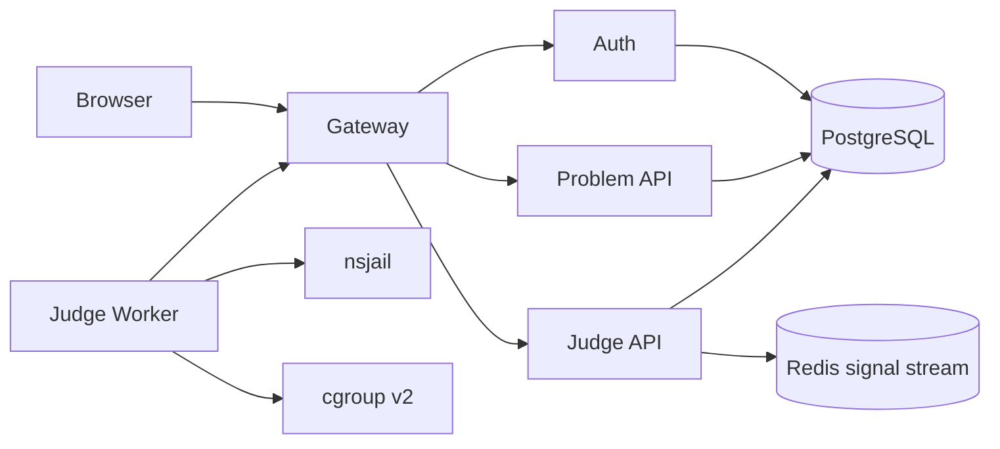
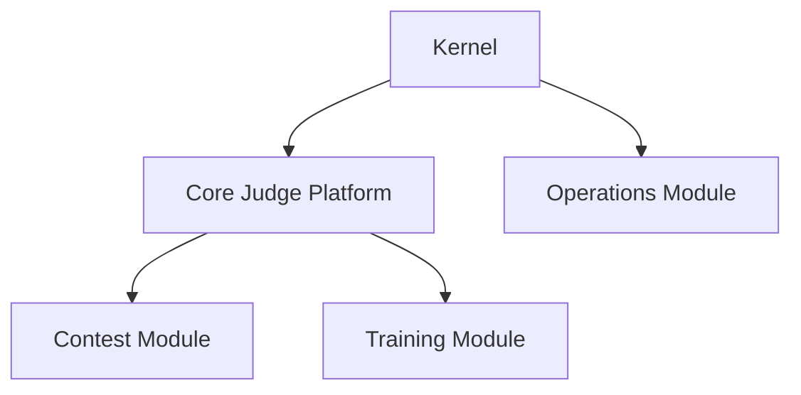

# 架构总览

> 文档状态：部分实现
> 适用范围：架构设计 / 开发 / 部署
> 最后更新：2026-06-26

## 1. 文档目的

本文档说明 OJOS 当前实现和目标架构之间的边界。它帮助读者区分已经落地的 Core Judge Platform、仍需运行验收的 Worker Link，以及未来的模块化 OJ Operating System。

## 2. 适用范围

适用于项目交接、架构评审、部署规划和功能路线讨论。

## 3. 当前实现

当前实现是一个分布式 OJ Control Plane 加外部 worker 节点。已包含 Gateway、Auth、Problem API、Judge API、Vue 前端、PostgreSQL、Redis signal history、artifact storage、Worker Link 和 Rust judge-worker。

## 4. 目标设计

目标架构是 Kernel + Core + 可安装模块。Contest、Training、Operations 等能力应作为模块追加，而不是在 Core 未稳定前硬编码进去。

## 5. 关键流程

目标拓扑：

## 6. 配置说明

当前配置分布在 `.env.example`、`frontend/.env.example`、`services/*/etc/*.yaml`、`deploy/compose` 和 `deploy/worker`。

## 7. 安全边界

Gateway 是唯一公开 API 入口。PostgreSQL、Redis 和内部 API 不公开。worker 不直连 DB/Redis，不读取本地 storage。

## 8. 验收方式

静态验收执行 `scripts/verify-static.ps1 -SkipDockerBuild`。Docker、Linux cgroup v2、nsjail 和多 worker 验收必须在外部环境执行。

## 9. 常见问题

- 把目标架构当成当前实现：以 `DOCS_STATUS.md` 为准。
- worker 需要本地 storage：说明部署方式错误。
- Contest 功能放进 Core：应等待模块契约和安装器。

## 10. 相关文档

- [服务拓扑](service-topology.md)
- [模块拓扑设计](module-topology.md)
- [Worker Link 协议](worker-link-protocol.md)
