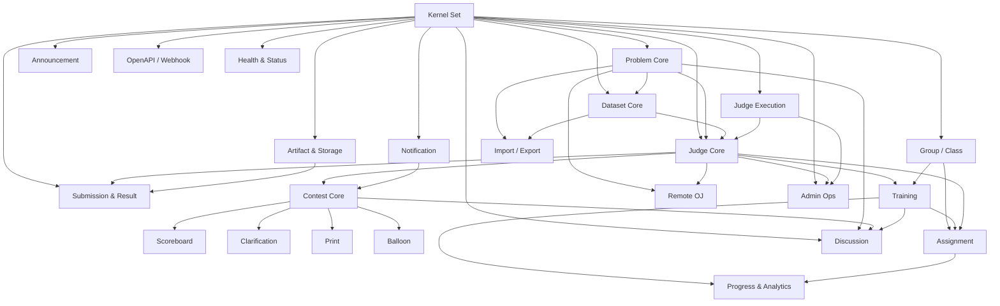
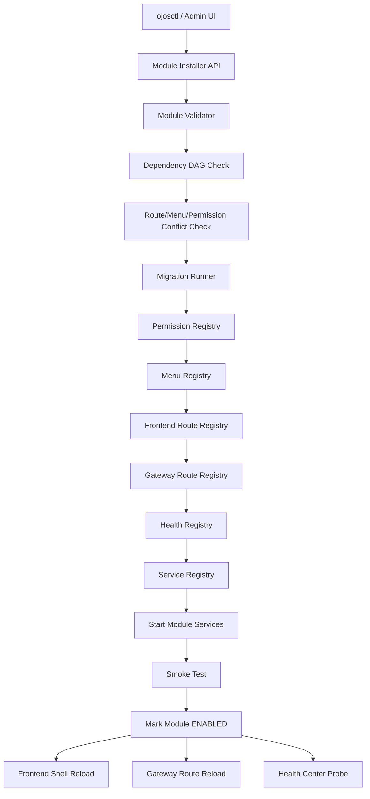
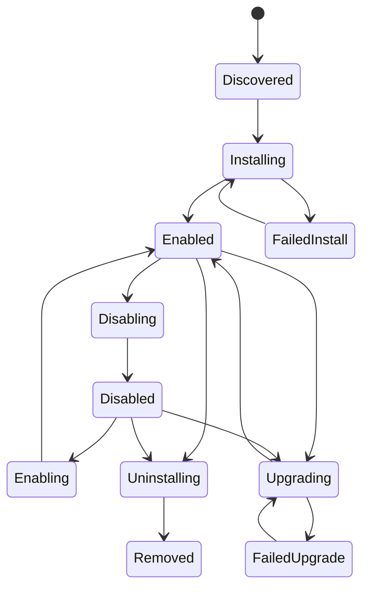
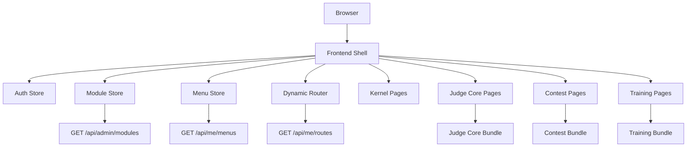
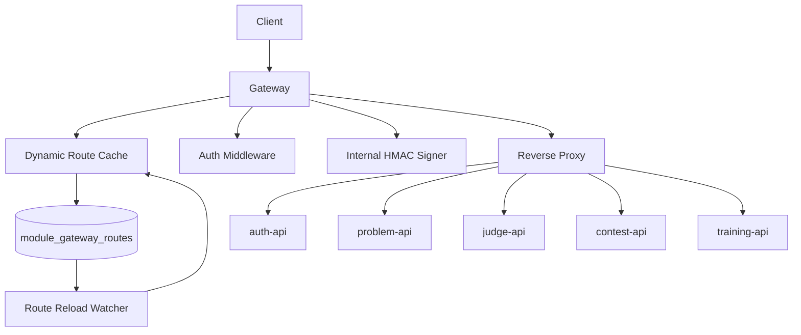

> 文档状态：已归档
> 警告：本文档仅保留历史参考，可能包含过时架构或旧部署方式，不可作为当前部署依据。

# OJOS 模块拓扑设计

## 1. 文档目标

本文档用于定义 OJOS 的模块化拓扑架构。OJOS 的目标不是单一在线评测系统，而是一个可以按需安装、启用、禁用、升级、卸载模块的 OJ Operating System。

系统最终应支持：

* 基础内核稳定运行。
* 业务模块按集合组织。
* 每个模块由多个微服务、前端页面、权限点、数据库迁移、菜单、健康检查和部署片段组成。
* 模块之间通过显式依赖关系连接。
* 安装器能够根据模块拓扑自动判断安装顺序、卸载影响范围、升级风险。
* 前端后台能够以拓扑图形式展示整个 OJOS 的模块状态。
* 评测节点可以作为外部 Worker 模块横向扩展，支持多机并发评测。
* A 模块完整上线后，再通过安装器追加 B、C、D 等模块。

本文档定义四层结构：

```text
Service 微服务
    ↓
Module 模块
    ↓
Set 集合
    ↓
OJOS 整体系统
```

---

## 2. 核心概念

### 2.1 Service：微服务

Service 是一个职责相对独立、可以单独运行、单独扩容、单独观测的进程或服务单元。

示例：

```text
gateway
auth-api
permission-api
problem-api
dataset-api
submission-api
judge-api
worker-link-api
judge-worker
contest-api
scoreboard-api
training-api
notification-api
module-registry-api
module-installer-api
health-api
```

Service 不等同于 Module。一个 Module 可以包含多个 Service。

---

### 2.2 Module：模块

Module 是一个完整业务能力单元，由以下内容组成：

```text
后端服务
前端页面
权限点
菜单
前端路由
Gateway 路由
数据库迁移
配置项
Worker 定义
存储桶定义
健康检查
审计点
部署片段
验收脚本
文档
```

示例：

```text
Judge Core Module
Contest Module
Training Module
Discussion Module
Remote OJ Module
Module Runtime Module
```

模块是安装器处理的最小业务单位。

---

### 2.3 Set：集合

Set 是若干相关模块组成的能力域。

示例：

```text
Kernel Set
Core Capability Set
Competition Set
Education Set
Collaboration Set
Integration Set
Operations Set
```

集合主要用于：

* 规划安装包。
* 控制开发阶段。
* 展示模块拓扑。
* 定义推荐安装组合。

---

### 2.4 OJOS

OJOS 是所有 Set、Module、Service、基础设施共同组成的完整系统。

OJOS 的目标是：

```text
Kernel 固定稳定
Core 能力完整上线
业务扩展模块热插拔
安装器统一管理 ABC... 模块
```

---

## 3. 总体拓扑

```mermaid
flowchart TB
    OJOS[OJOS / OJ Operating System]

    OJOS --> KERNEL[Set 0: Kernel Set]
    OJOS --> CORE[Set 1: Core Capability Set]
    OJOS --> COMPETITION[Set 2: Competition Set]
    OJOS --> EDUCATION[Set 3: Education Set]
    OJOS --> COLLAB[Set 4: Collaboration Set]
    OJOS --> INTEGRATION[Set 5: Integration Set]
    OJOS --> OPS[Set 6: Operations Set]

    KERNEL --> K1[Edge & UI Shell Module]
    KERNEL --> K2[Identity & Access Module]
    KERNEL --> K3[Module Runtime Module]
    KERNEL --> K4[Config & Secret Module]
    KERNEL --> K5[Audit & Policy Module]

    CORE --> C1[Problem Core Module]
    CORE --> C2[Dataset Core Module]
    CORE --> C3[Judge Core Module]
    CORE --> C4[Submission & Result Module]
    CORE --> C5[Artifact & Storage Module]
    CORE --> C6[Judge Execution Module]

    COMPETITION --> B1[Contest Core Module]
    COMPETITION --> B2[Scoreboard Module]
    COMPETITION --> B3[Clarification Module]
    COMPETITION --> B4[Print Module]
    COMPETITION --> B5[Balloon Module]

    EDUCATION --> E1[Group / Class Module]
    EDUCATION --> E2[Training Module]
    EDUCATION --> E3[Assignment Module]
    EDUCATION --> E4[Progress & Analytics Module]

    COLLAB --> L1[Notification Module]
    COLLAB --> L2[Discussion Module]
    COLLAB --> L3[Announcement Module]

    INTEGRATION --> I1[Remote OJ Module]
    INTEGRATION --> I2[OpenAPI / Webhook Module]
    INTEGRATION --> I3[Import / Export Module]

    OPS --> O1[Admin Ops Module]
    OPS --> O2[Health & Status Module]
    OPS --> O3[Observability Module]
    OPS --> O4[Backup & Retention Module]
```



---

## 4. Set 分组设计

### 4.1 Set 0：Kernel Set

Kernel Set 是 OJOS 的内核集合，不建议作为普通热插拔模块频繁卸载。

Kernel Set 提供：

* 用户认证。
* 权限系统。
* Gateway 统一入口。
* 模块注册。
* 模块安装。
* 前端壳。
* 动态菜单。
* 动态路由。
* 配置中心。
* 内部服务认证。
* 审计。
* 健康检查基础设施。

包含模块：

| 模块                | 说明                         | 热插拔等级     |
| ----------------- | -------------------------- | --------- |
| Edge & UI Shell   | Gateway、Frontend Shell、BFF | Kernel 固定 |
| Identity & Access | Auth、Permission、User、Role  | Kernel 固定 |
| Module Runtime    | 模块注册、安装、生命周期               | Kernel 固定 |
| Config & Secret   | 配置、密钥、内部 HMAC              | Kernel 固定 |
| Audit & Policy    | 审计、策略检查                    | 谨慎热插拔     |

---

### 4.2 Set 1：Core Capability Set

Core Capability Set 是 A 集合，是最先要做到可上线的核心 OJ 能力。

包含模块：

| 模块                  | 说明                        | 热插拔等级      |
| ------------------- | ------------------------- | ---------- |
| Problem Core        | 题目元信息、题面、CRUD             | 谨慎热插拔      |
| Dataset Core        | 题目包、测试数据、验证               | 谨慎热插拔      |
| Judge Core          | 提交、调度、Worker Link         | 谨慎热插拔      |
| Submission & Result | 提交结果、case 详情、调试日志         | 谨慎热插拔      |
| Artifact & Storage  | 源码、题目包、结果产物访问             | 谨慎热插拔      |
| Judge Execution     | judge-worker、sandbox、资源限制 | Worker 热插拔 |

Core Capability Set 完成后，系统应具备一个完整上线级 OJ 的能力。

---

### 4.3 Set 2：Competition Set

Competition Set 是 B 集合，用于比赛能力。

包含模块：

| 模块            | 说明           | 热插拔等级 |
| ------------- | ------------ | ----- |
| Contest Core  | 比赛创建、报名、题目配置 | 适合热插拔 |
| Scoreboard    | 榜单、封榜、滚榜     | 适合热插拔 |
| Clarification | 比赛提问与回复      | 适合热插拔 |
| Print         | 打印服务         | 适合热插拔 |
| Balloon       | 气球派发         | 适合热插拔 |

Competition Set 依赖 Core Capability Set。

---

### 4.4 Set 3：Education Set

Education Set 用于教学、训练、作业、班级场景。

包含模块：

| 模块                   | 说明         | 热插拔等级 |
| -------------------- | ---------- | ----- |
| Group / Class        | 组织、班级、成员   | 谨慎热插拔 |
| Training             | 题单、训练计划    | 适合热插拔 |
| Assignment           | 作业、截止时间、成绩 | 适合热插拔 |
| Progress & Analytics | 学习进度、统计分析  | 适合热插拔 |

---

### 4.5 Set 4：Collaboration Set

Collaboration Set 用于站内协作和信息流。

包含模块：

| 模块           | 说明        | 热插拔等级 |
| ------------ | --------- | ----- |
| Notification | 站内通知、消息派发 | 适合热插拔 |
| Discussion   | 讨论、评论、题解  | 适合热插拔 |
| Announcement | 公告、活动消息   | 适合热插拔 |

---

### 4.6 Set 5：Integration Set

Integration Set 用于外部系统接入。

包含模块：

| 模块                | 说明               | 热插拔等级 |
| ----------------- | ---------------- | ----- |
| Remote OJ         | 外部 OJ 抓题、同步、远程提交 | 适合热插拔 |
| OpenAPI / Webhook | 开放 API、Webhook   | 适合热插拔 |
| Import / Export   | 数据导入导出           | 适合热插拔 |

---

### 4.7 Set 6：Operations Set

Operations Set 用于上线后的运维能力。

包含模块：

| 模块                 | 说明         | 热插拔等级  |
| ------------------ | ---------- | ------ |
| Admin Ops          | 后台运维操作     | 谨慎热插拔  |
| Health & Status    | 健康检查、状态页   | 谨慎热插拔  |
| Observability      | 指标、日志、链路追踪 | 适合外部集成 |
| Backup & Retention | 备份、恢复、保留策略 | 谨慎热插拔  |

---

## 5. 微服务总清单

### 5.1 Kernel Set 微服务

#### Edge & UI Shell Module

| 服务名            | 类型           | 职责                          |
| -------------- | ------------ | --------------------------- |
| gateway        | HTTP Gateway | 统一入口、反向代理、JWT 解析、内部 HMAC 签名 |
| frontend-shell | Frontend     | 主前端壳、动态菜单、动态路由              |
| public-bff     | HTTP API，可选  | 前台聚合接口                      |
| admin-bff      | HTTP API，可选  | 后台聚合接口                      |

#### Identity & Access Module

| 服务名              | 类型       | 职责                  |
| ---------------- | -------- | ------------------- |
| auth-api         | HTTP API | 注册、登录、profile、token |
| permission-api   | HTTP API | 权限点、角色、用户角色、资源级授权   |
| policy-evaluator | 内部组件     | 权限判断核心              |
| user-api         | HTTP API | 用户列表、用户资料、用户管理      |
| audit-log-api    | HTTP API | 权限变更和敏感操作审计         |

#### Module Runtime Module

| 服务名                         | 类型       | 职责             |
| --------------------------- | -------- | -------------- |
| module-registry-api         | HTTP API | 模块注册、查询、拓扑     |
| module-installer-api        | HTTP API | 安装、启用、禁用、升级、卸载 |
| module-lifecycle-controller | 后台控制器    | 执行生命周期动作       |
| route-menu-registry-api     | 内部 API   | 动态菜单、动态前端路由    |
| health-registry-api         | 内部 API   | 模块健康检查注册       |

#### Config & Secret Module

| 服务名                       | 类型         | 职责               |
| ------------------------- | ---------- | ---------------- |
| config-api                | HTTP API   | 平台配置、模块配置        |
| secret-api                | HTTP API   | 密钥元数据管理          |
| secret-rotation-worker    | Worker     | 密钥轮换             |
| internal-auth-key-manager | Worker/API | 内部服务 HMAC key 管理 |

#### Audit & Policy Module

| 服务名                    | 类型       | 职责        |
| ---------------------- | -------- | --------- |
| audit-api              | HTTP API | 审计日志查询    |
| policy-check-api       | HTTP API | 策略检查      |
| audit-retention-worker | Worker   | 审计日志归档与清理 |

---

### 5.2 Core Capability Set 微服务

#### Problem Core Module

| 服务名                  | 类型          | 职责             |
| -------------------- | ----------- | -------------- |
| problem-api          | HTTP API    | 题目 CRUD、题面、元信息 |
| problem-public-api   | HTTP API，可选 | 前台题目只读接口       |
| problem-admin-api    | HTTP API，可选 | 后台题目管理接口       |
| problem-index-worker | Worker，可选   | 搜索索引、标签统计      |

#### Dataset Core Module

| 服务名                          | 类型       | 职责            |
| ---------------------------- | -------- | ------------- |
| dataset-api                  | HTTP API | 题目包、测试数据、版本管理 |
| package-validator-worker     | Worker   | 题目包格式验证       |
| package-build-worker         | Worker   | 题目包构建、发布态生成   |
| dataset-import-export-worker | Worker   | 数据集导入导出       |

#### Judge Core Module

| 服务名                   | 类型                | 职责                       |
| --------------------- | ----------------- | ------------------------ |
| submission-api        | HTTP API          | 创建提交、取消提交、重测             |
| submission-query-api  | HTTP API          | 提交列表、提交详情                |
| judge-control-api     | HTTP API          | 管理员评测控制、requeue、drain    |
| worker-link-api       | HTTP API          | Worker 注册、心跳、claim、上报    |
| judge-dispatcher      | Worker/Controller | 任务调度、分配、队列维护             |
| judge-recovery-worker | Worker            | 过期 lease 恢复、失活 worker 处理 |

#### Submission & Result Module

| 服务名                     | 类型       | 职责                         |
| ----------------------- | -------- | -------------------------- |
| result-api              | HTTP API | 结果查询、case 结果、debug 日志      |
| result-aggregator       | Worker   | 聚合 case 结果为 submission 总结果 |
| result-retention-worker | Worker   | 结果保留与清理                    |

#### Artifact & Storage Module

| 服务名                       | 类型       | 职责               |
| ------------------------- | -------- | ---------------- |
| artifact-api              | HTTP API | 源码、题目包、结果产物访问    |
| artifact-upload-api       | HTTP API | Worker 上传结果与日志   |
| artifact-retention-worker | Worker   | 产物清理             |
| artifact-digest-worker    | Worker   | 产物 hash 校验、完整性检查 |

#### Judge Execution Module

| 服务名                      | 类型     | 职责                    |
| ------------------------ | ------ | --------------------- |
| judge-worker             | Worker | 编译、运行、判题、上传结果         |
| sandbox-runner           | 内部组件   | nsjail + cgroup v2 执行 |
| resource-meter           | 内部组件   | time/memory/output 采集 |
| language-runtime-manager | 内部组件   | 语言运行模板管理              |

---

### 5.3 Competition Set 微服务

#### Contest Core Module

| 服务名                     | 类型       | 职责              |
| ----------------------- | -------- | --------------- |
| contest-api             | HTTP API | 比赛 CRUD、报名、参赛权限 |
| contest-problem-api     | HTTP API | 比赛题目配置          |
| contest-submission-api  | HTTP API | 比赛提交入口          |
| contest-schedule-worker | Worker   | 自动开始、结束、封榜触发    |
| contest-access-worker   | Worker   | 访问控制状态刷新        |

#### Scoreboard Module

| 服务名                       | 类型       | 职责           |
| ------------------------- | -------- | ------------ |
| scoreboard-api            | HTTP API | 榜单查询         |
| scoreboard-stream-worker  | Worker   | 实时榜单更新       |
| scoreboard-rebuild-worker | Worker   | 全量重建榜单       |
| scoreboard-freeze-worker  | Worker   | 封榜、解榜、滚榜状态处理 |

#### Clarification Module

| 服务名                         | 类型       | 职责         |
| --------------------------- | -------- | ---------- |
| clarification-api           | HTTP API | 提问、回复、公开回复 |
| clarification-notify-worker | Worker   | 提醒参赛者和管理员  |

#### Print Module

| 服务名                  | 类型             | 职责        |
| -------------------- | -------------- | --------- |
| print-api            | HTTP API       | 打印请求提交、审批 |
| print-queue-worker   | Worker         | 打印队列处理    |
| print-device-adapter | Worker/Adapter | 打印机适配     |

#### Balloon Module

| 服务名                     | 类型       | 职责       |
| ----------------------- | -------- | -------- |
| balloon-api             | HTTP API | 气球任务管理   |
| balloon-dispatch-worker | Worker   | 气球派发状态流转 |

---

### 5.4 Education Set 微服务

#### Group / Class Module

| 服务名                      | 类型       | 职责       |
| ------------------------ | -------- | -------- |
| group-api                | HTTP API | 组织、班级、团队 |
| membership-api           | HTTP API | 成员管理     |
| membership-import-worker | Worker   | 成员批量导入   |

#### Training Module

| 服务名                   | 类型       | 职责      |
| --------------------- | -------- | ------- |
| training-api          | HTTP API | 题单、训练计划 |
| training-progress-api | HTTP API | 训练进度    |
| training-sync-worker  | Worker   | 训练统计刷新  |

#### Assignment Module

| 服务名                         | 类型       | 职责        |
| --------------------------- | -------- | --------- |
| assignment-api              | HTTP API | 作业创建、提交规则 |
| assignment-grade-api        | HTTP API | 成绩查询      |
| assignment-evaluator-worker | Worker   | 作业成绩聚合    |

#### Progress & Analytics Module

| 服务名                     | 类型       | 职责   |
| ----------------------- | -------- | ---- |
| progress-api            | HTTP API | 用户进度 |
| analytics-api           | HTTP API | 统计分析 |
| analytics-rollup-worker | Worker   | 周期聚合 |

---

### 5.5 Collaboration Set 微服务

#### Notification Module

| 服务名                          | 类型          | 职责        |
| ---------------------------- | ----------- | --------- |
| notification-api             | HTTP API    | 通知查询、标记已读 |
| notification-delivery-worker | Worker      | 通知派发      |
| notification-template-api    | HTTP API，可选 | 模板管理      |

#### Discussion Module

| 服务名                     | 类型       | 职责        |
| ----------------------- | -------- | --------- |
| discussion-api          | HTTP API | 讨论、评论、题解  |
| moderation-worker       | Worker   | 举报处理、内容审核 |
| discussion-index-worker | Worker   | 搜索索引      |

#### Announcement Module

| 服务名                         | 类型       | 职责   |
| --------------------------- | -------- | ---- |
| announcement-api            | HTTP API | 公告管理 |
| announcement-publish-worker | Worker   | 定时发布 |

---

### 5.6 Integration Set 微服务

#### Remote OJ Module

| 服务名                        | 类型           | 职责                        |
| -------------------------- | ------------ | ------------------------- |
| remote-oj-api              | HTTP API     | 远程 OJ 配置、账号绑定             |
| remote-problem-sync-worker | Worker       | 远程题目同步                    |
| remote-submit-worker       | Worker       | 远程提交                      |
| remote-result-sync-worker  | Worker       | 远程结果同步                    |
| remote-oj-adapter-host     | Adapter Host | Codeforces、AtCoder、洛谷等适配器 |

#### OpenAPI / Webhook Module

| 服务名                     | 类型       | 职责            |
| ----------------------- | -------- | ------------- |
| openapi-gateway         | HTTP API | 外部开放接口        |
| webhook-api             | HTTP API | Webhook 注册    |
| webhook-delivery-worker | Worker   | Webhook 投递与重试 |

#### Import / Export Module

| 服务名               | 类型       | 职责       |
| ----------------- | -------- | -------- |
| import-export-api | HTTP API | 导入导出任务管理 |
| import-worker     | Worker   | 执行导入     |
| export-worker     | Worker   | 执行导出     |

---

### 5.7 Operations Set 微服务

#### Admin Ops Module

| 服务名              | 类型       | 职责                      |
| ---------------- | -------- | ----------------------- |
| admin-ops-api    | HTTP API | 后台运维操作                  |
| queue-admin-api  | HTTP API | 队列查看、重试、清理              |
| worker-admin-api | HTTP API | Worker 状态、drain、disable |

#### Health & Status Module

| 服务名                 | 类型       | 职责     |
| ------------------- | -------- | ------ |
| health-api          | HTTP API | 服务健康检查 |
| status-page-api     | HTTP API | 状态页    |
| health-probe-worker | Worker   | 周期探测   |

#### Observability Module

| 服务名              | 类型      | 职责              |
| ---------------- | ------- | --------------- |
| metrics-exporter | Service | Prometheus 指标导出 |
| trace-collector  | Service | 链路追踪采集          |
| log-ingest       | Service | 日志采集            |

#### Backup & Retention Module

| 服务名               | 类型       | 职责      |
| ----------------- | -------- | ------- |
| backup-controller | Worker   | 备份任务    |
| retention-worker  | Worker   | 数据保留与清理 |
| restore-api       | HTTP API | 恢复操作入口  |

---

## 6. 模块依赖拓扑



---

## 7. 热插拔分级

### 7.1 L1：UI 热插拔

可以热插拔：

```text
菜单
前端路由
前端页面
模块入口
状态页入口
```

特点：

* 风险低。
* 可以运行时刷新。
* 禁用模块后菜单和页面立即隐藏。

---

### 7.2 L2：API 热插拔

可以热插拔：

```text
Gateway route
模块后端 API
模块 BFF
Webhook endpoint
OpenAPI endpoint
```

要求：

* Gateway 动态路由必须 fail-closed。
* 模块禁用后 API 返回 404 或 503。
* 不允许禁用后仍然能访问后端服务。

---

### 7.3 L3：Worker 热插拔

可以热插拔：

```text
judge-worker node
remote-oj-worker
scoreboard-worker
notification-worker
import/export-worker
```

要求：

* Worker 必须注册。
* Worker 必须 heartbeat。
* Worker 必须有 lease。
* Worker 下线后任务可恢复。
* 不允许任务永久卡死。
* 不允许旧 lease 覆盖新结果。

---

### 7.4 L4：Data 热插拔

谨慎热插拔：

```text
数据库迁移
存储桶
索引
事件 topic
队列表
```

要求：

* 必须有 migration。
* 必须有 rollback 或 disable 策略。
* 默认卸载不删数据。
* 数据删除必须显式危险确认。

---

### 7.5 L5：Kernel 升级

不建议普通热插拔：

```text
Gateway
Auth
Permission
Module Registry
Installer
Config
Secret
JWT key
HMAC key ring
```

要求：

* 需要维护窗口。
* 需要升级计划。
* 需要备份。
* 需要回滚策略。

---

## 8. Module Runtime 拓扑



模块安装不是复制文件，而是完整生命周期：

```text
validate
dependency check
conflict check
migration
permission registration
menu registration
frontend route registration
gateway route registration
health registration
service registration
start service
smoke test
enable
```

任何一步失败必须进入失败状态，并输出安装报告。

---

## 9. 模块状态机



模块状态：

```text
DISCOVERED
INSTALLING
ENABLED
DISABLING
DISABLED
ENABLING
UPGRADING
FAILED_INSTALL
FAILED_UPGRADE
UNINSTALLING
REMOVED
```

---

## 10. 模块数据模型设计

### 10.1 module_sets

```sql
CREATE TABLE module_sets (
    id BIGSERIAL PRIMARY KEY,
    set_id TEXT NOT NULL UNIQUE,
    name TEXT NOT NULL,
    description TEXT NOT NULL DEFAULT '',
    sort_order INT NOT NULL DEFAULT 0,
    created_at TIMESTAMPTZ NOT NULL DEFAULT NOW()
);
```

---

### 10.2 module_nodes

```sql
CREATE TABLE module_nodes (
    id BIGSERIAL PRIMARY KEY,
    module_id TEXT NOT NULL UNIQUE,
    set_id TEXT NOT NULL,
    name TEXT NOT NULL,
    version TEXT NOT NULL,
    status TEXT NOT NULL,
    kind TEXT NOT NULL,
    manifest JSONB NOT NULL,
    created_at TIMESTAMPTZ NOT NULL DEFAULT NOW(),
    updated_at TIMESTAMPTZ NOT NULL DEFAULT NOW()
);
```

`kind` 可选值：

```text
kernel
feature
worker
integration
ops
theme
```

---

### 10.3 module_edges

```sql
CREATE TABLE module_edges (
    id BIGSERIAL PRIMARY KEY,
    from_module_id TEXT NOT NULL,
    to_module_id TEXT NOT NULL,
    edge_type TEXT NOT NULL,
    version_constraint TEXT NOT NULL DEFAULT '',
    required BOOLEAN NOT NULL DEFAULT TRUE,
    created_at TIMESTAMPTZ NOT NULL DEFAULT NOW(),
    UNIQUE(from_module_id, to_module_id, edge_type)
);
```

`edge_type` 可选值：

```text
depends_on
extends
provides_service_to
uses_permission_from
uses_storage_from
uses_event_from
```

---

### 10.4 module_components

```sql
CREATE TABLE module_components (
    id BIGSERIAL PRIMARY KEY,
    module_id TEXT NOT NULL,
    component_id TEXT NOT NULL,
    component_type TEXT NOT NULL,
    status TEXT NOT NULL,
    config JSONB NOT NULL DEFAULT '{}',
    created_at TIMESTAMPTZ NOT NULL DEFAULT NOW(),
    updated_at TIMESTAMPTZ NOT NULL DEFAULT NOW(),
    UNIQUE(module_id, component_id)
);
```

`component_type` 可选值：

```text
backend_service
frontend_bundle
worker_service
migration
permission_set
menu_set
gateway_route_set
health_check
storage_bucket
event_topic
config_schema
```

---

### 10.5 module_installations

```sql
CREATE TABLE module_installations (
    id BIGSERIAL PRIMARY KEY,
    module_id TEXT NOT NULL UNIQUE,
    name TEXT NOT NULL,
    version TEXT NOT NULL,
    status TEXT NOT NULL,
    manifest JSONB NOT NULL,
    installed_at TIMESTAMPTZ NOT NULL DEFAULT NOW(),
    updated_at TIMESTAMPTZ NOT NULL DEFAULT NOW(),
    enabled_at TIMESTAMPTZ,
    disabled_at TIMESTAMPTZ
);
```

---

### 10.6 module_migrations

```sql
CREATE TABLE module_migrations (
    id BIGSERIAL PRIMARY KEY,
    module_id TEXT NOT NULL,
    version TEXT NOT NULL,
    migration_name TEXT NOT NULL,
    checksum TEXT NOT NULL,
    applied_at TIMESTAMPTZ NOT NULL DEFAULT NOW(),
    UNIQUE(module_id, migration_name)
);
```

---

### 10.7 module_permissions

```sql
CREATE TABLE module_permissions (
    id BIGSERIAL PRIMARY KEY,
    module_id TEXT NOT NULL,
    permission_key TEXT NOT NULL UNIQUE,
    description TEXT NOT NULL DEFAULT '',
    created_at TIMESTAMPTZ NOT NULL DEFAULT NOW()
);
```

---

### 10.8 module_menus

```sql
CREATE TABLE module_menus (
    id BIGSERIAL PRIMARY KEY,
    module_id TEXT NOT NULL,
    menu_key TEXT NOT NULL UNIQUE,
    title TEXT NOT NULL,
    route_path TEXT NOT NULL,
    icon TEXT NOT NULL DEFAULT '',
    parent_key TEXT NOT NULL DEFAULT '',
    sort_order INT NOT NULL DEFAULT 0,
    required_permission TEXT NOT NULL DEFAULT '',
    enabled BOOLEAN NOT NULL DEFAULT TRUE
);
```

---

### 10.9 module_frontend_routes

```sql
CREATE TABLE module_frontend_routes (
    id BIGSERIAL PRIMARY KEY,
    module_id TEXT NOT NULL,
    route_path TEXT NOT NULL,
    route_name TEXT NOT NULL,
    component_key TEXT NOT NULL,
    required_permission TEXT NOT NULL DEFAULT '',
    enabled BOOLEAN NOT NULL DEFAULT TRUE,
    created_at TIMESTAMPTZ NOT NULL DEFAULT NOW(),
    UNIQUE(module_id, route_path)
);
```

---

### 10.10 module_gateway_routes

```sql
CREATE TABLE module_gateway_routes (
    id BIGSERIAL PRIMARY KEY,
    module_id TEXT NOT NULL,
    prefix TEXT NOT NULL UNIQUE,
    target_service TEXT NOT NULL,
    auth_mode TEXT NOT NULL,
    enabled BOOLEAN NOT NULL DEFAULT TRUE
);
```

---

## 11. Module Manifest 规范

每个模块必须提供 `module.yaml`。

示例：Judge Core Module。

```yaml
id: ojos.judge-core
name: Judge Core
version: 1.0.0
set: core-capability
kind: feature
description: Problem, dataset, submission, judge worker and result system.

requires:
  platform: ">=1.0.0"
  modules:
    - ojos.kernel.identity >= 1.0.0
    - ojos.kernel.permission >= 1.0.0
    - ojos.kernel.module-runtime >= 1.0.0

provides:
  permissions:
    - problem.view
    - problem.create
    - problem.update
    - problem.delete
    - problem.package.manage
    - judge.submit
    - judge.submission.view.own
    - judge.submission.view.all
    - judge.submission.cancel
    - judge.submission.rejudge
    - judge.admin

  backend_services:
    - id: problem-api
      path: backend/problem-api
      port: 8083
      health: /health

    - id: judge-api
      path: backend/judge-api
      port: 8082
      health: /health

  worker_services:
    - id: judge-worker
      path: worker
      mode: external-node

  frontend:
    entry: frontend/module.ts
    routes: frontend/routes.ts
    menus: frontend/menus.ts

  gateway_routes:
    - prefix: /api/problem
      service: problem-api
      auth: user

    - prefix: /api/judge
      service: judge-api
      auth: user

    - prefix: /api/judge/worker
      service: judge-api
      auth: worker

  migrations:
    path: migrations

  configs:
    - key: JUDGE_TASK_LEASE_SECONDS
      default: "120"

    - key: JUDGE_MAX_ATTEMPT
      default: "3"

  storage:
    buckets:
      - problems
      - submissions
      - judge-artifacts

  health_checks:
    - id: problem-api
    - id: judge-api
    - id: worker-cluster
    - id: queue
    - id: artifact-storage

lifecycle:
  pre_install: scripts/pre_install
  post_install: scripts/post_install
  pre_disable: scripts/pre_disable
  post_disable: scripts/post_disable
  pre_uninstall: scripts/pre_uninstall
  post_uninstall: scripts/post_uninstall

uninstall:
  default_policy: disable_only
  allow_data_removal: false
```

---

## 12. 前端拓扑设计

### 12.1 Frontend Shell

Frontend Shell 负责：

```text
登录态
路由守卫
权限守卫
动态菜单
动态路由
模块页面加载
全局错误页
主题
布局
```

### 12.2 前端拓扑



### 12.3 前端热插拔阶段

分阶段实现：

```text
Phase 1：构建期集成 + 动态启用
Phase 2：模块 manifest 化 + 菜单/路由动态化
Phase 3：Installer 管理模块启用/禁用
Phase 4：运行时 remote frontend bundle
```

早期不建议直接上 remote frontend bundle。先使用构建期集成，降低复杂度。

---

## 13. Gateway 动态路由设计

Gateway 长期不应写死模块路由。

### 13.1 目标

```text
模块安装后注册 route
模块启用后 Gateway 加载 route
模块禁用后 Gateway 关闭 route
模块卸载后 route 删除或标记 disabled
```

### 13.2 拓扑



### 13.3 Fail-Closed 规则

Gateway 必须遵守：

```text
没有匹配 route：404
模块 disabled：404 或 503
内部签名失败：502/500，不继续转发
target service 不健康：503
auth_mode 不匹配：401/403
```

---

## 14. 安装器设计

安装器命名：

```text
ojosctl
```

### 14.1 命令

```bash
ojosctl module list
ojosctl module topology
ojosctl module inspect ./modules/judge-core
ojosctl module validate ./modules/judge-core
ojosctl module install ./modules/judge-core
ojosctl module enable ojos.judge-core
ojosctl module disable ojos.judge-core
ojosctl module upgrade ojos.judge-core
ojosctl module uninstall ojos.judge-core
ojosctl module doctor ojos.judge-core
ojosctl module package ./modules/contest
ojosctl module verify contest.ojosmod
```

---

### 14.2 安装流程

```text
1. 读取 module.yaml
2. 校验 manifest
3. 校验平台版本
4. 校验依赖模块
5. 检测依赖环
6. 拓扑排序
7. 检测 route/menu/permission/service 冲突
8. 备份当前 module registry
9. 执行数据库迁移
10. 注册权限点
11. 注册菜单
12. 注册前端路由
13. 注册 Gateway route
14. 注册 health check
15. 注册 service
16. 写入 module_installations
17. 启动模块服务
18. Gateway reload
19. Frontend Shell reload
20. 执行 smoke test
21. 标记 ENABLED
22. 输出安装报告
```

---

### 14.3 禁用流程

```text
1. 检查是否有其他 enabled 模块依赖当前模块
2. 有依赖则拒绝或要求级联禁用
3. 执行 pre_disable
4. 停止接收新请求
5. Gateway route disabled
6. Frontend menu disabled
7. Frontend route disabled
8. Worker drain
9. Health check disabled
10. 标记 DISABLED
11. 执行 post_disable
```

---

### 14.4 卸载流程

默认策略：

```text
disable_only
```

卸载不默认删除数据。

可选策略：

```text
disable_only
remove_code_keep_data
remove_code_and_data
```

危险操作必须显式确认。

---

## 15. A/B/C 集合路线

### 15.1 A：Core Judge Platform

A 是第一个完整上线集合。

包含：

```text
Kernel 最小能力
Problem Core
Dataset Core
Judge Core
Submission & Result
Artifact & Storage
Judge Execution
Admin Ops 最小能力
Health & Status 最小能力
```

完成标准：

```text
用户能注册、登录、看题、提交、看结果
管理员能创建题、校验题目包、管理权限、看 worker、看健康状态
多台 worker 能并发评测
资源限制可用
四语言验收通过
E2E 文档和脚本完整
Public API 不泄露内部路径
```

---

### 15.2 B：Competition Platform

B 是第一个通过安装器追加的集合。

包含：

```text
Contest Core
Scoreboard
Clarification
Print
Balloon
Notification
```

依赖：

```text
Kernel
Problem Core
Judge Core
Submission & Result
```

完成标准：

```text
安装前没有 contest 菜单和 API
安装后自动出现 contest 菜单和 API
管理员能创建比赛
用户能报名和提交
Scoreboard 正确
禁用 B 后菜单和 API 消失
A 不受影响
```

---

### 15.3 C：Education Platform

包含：

```text
Group / Class
Training
Assignment
Progress & Analytics
Notification
```

依赖：

```text
Kernel
Problem Core
Judge Core
Submission & Result
```

完成标准：

```text
教师能创建班级
教师能布置训练和作业
学生能完成作业
系统能统计进度和成绩
禁用 C 后不影响 A/B
```

---

## 16. 开发阶段规划

### Phase 1：A 集合上线收口

目标：当前已有 Judge Core 系统达到可上线级。

任务：

```text
修复构建/格式/警告
清理旧文档
补齐 Admin Health
补齐 Admin Users
补齐 Admin Permissions
补齐 Permission Check
补齐权限管理后端
补齐 E2E 自动化脚本
完成四语言资源限制验收
完成双 worker 并发验收
完成 worker crash recovery 验收
完成部署文档
完成安全复扫
```

产物：

```text
A 集合可上线
tag: v0.1.0-core-judge-ga
```

---

### Phase 2：A 模块 Manifest 化

目标：把现有 A 登记成模块。

任务：

```text
创建 modules/judge-core/module.yaml
抽出 permissions 声明
抽出 menus 声明
抽出 routes 声明
抽出 health checks 声明
抽出 configs 声明
抽出 migrations 声明
把 A 写入 module registry
前端菜单从 registry 读取
```

---

### Phase 3：Module Registry v0

目标：实现模块拓扑只读视图。

任务：

```text
创建 module_sets
创建 module_nodes
创建 module_edges
创建 module_components
创建 module_installations
实现 GET /api/admin/modules
实现 GET /api/admin/modules/topology
实现 GET /api/admin/modules/:id
实现 /admin/modules
实现 /admin/modules/topology
```

---

### Phase 4：Installer v0

目标：支持本地模块安装、启用、禁用。

任务：

```text
ojosctl module validate
ojosctl module install
ojosctl module enable
ojosctl module disable
ojosctl module list
模块依赖检查
route/menu/permission 冲突检查
安装报告
```

---

### Phase 5：B 集合作为第一个热插拔验证

目标：通过安装器追加 Contest。

任务：

```text
编写 contest module.yaml
编写 contest migrations
编写 contest backend
编写 contest frontend
编写 contest permissions
编写 contest menus
编写 contest routes
编写 contest health checks
通过 ojosctl 安装
通过 ojosctl 禁用
通过 ojosctl 启用
```

---

### Phase 6：Installer v1

目标：完整模块系统。

任务：

```text
module package
module upgrade
module rollback
dependency resolver
config schema
signature 预留
module store 预留
lifecycle hooks
remote frontend bundle 预研
```

---

## 17. 后台拓扑页面设计

### 17.1 页面

```text
/admin/modules
/admin/modules/topology
/admin/modules/sets
/admin/modules/:id
```

---

### 17.2 拓扑节点颜色

```text
绿色：ENABLED
灰色：DISABLED
黄色：INSTALLING / UPGRADING
红色：FAILED_INSTALL / FAILED_UPGRADE
蓝色：DISCOVERED
黑色：REMOVED
```

---

### 17.3 拓扑边样式

```text
实线：required dependency
虚线：optional dependency
红线：missing dependency
橙线：version mismatch
蓝线：extends
```

---

### 17.4 节点详情

点击模块节点后展示：

```text
module id
name
version
status
set
kind
dependencies
dependents
services
worker services
frontend routes
menus
permissions
migrations
health checks
storage buckets
config keys
install history
actions
```

---

## 18. 上线标准

每个集合上线前必须满足：

### 18.1 构建

```text
Go build 通过
Rust cargo check 通过
Frontend build 通过
Docker build 通过
```

---

### 18.2 测试

```text
单元测试
集成测试
E2E 测试
权限测试
安全测试
失败恢复测试
资源限制测试
```

---

### 18.3 文档

```text
架构文档
API 文档
数据库文档
部署文档
运维文档
故障排查文档
E2E 验收文档
```

---

### 18.4 安全

```text
Public API 不暴露内部路径
无硬编码 secret
无绕过权限
无裸内部服务
无危险默认配置
Worker token 有效
HMAC fail closed
模块 disabled 后 route 不可访问
```

---

### 18.5 运维

```text
health check
admin panel
structured logs
request_id
worker_id
submission_id
metrics 预留
backup / restore 说明
```

---

## 19. 最终目标形态

最终 OJOS 应该支持：

```bash
ojosctl module install judge-core
ojosctl module install contest
ojosctl module install training
ojosctl module install group
ojosctl module install discussion
ojosctl module install remote-oj
ojosctl module install observability
```

安装完成后，系统自动接入：

```text
后端 API
前端页面
菜单
权限
数据库迁移
Gateway route
Health check
Worker 定义
部署配置
E2E 验收脚本
```

最终系统不是写死的 OJ，而是一个模块化 OJ 平台。

A 是第一个完整上线集合。

B 是第一个通过安装器追加的集合。

C/D/E/F 后续都必须遵守同一套模块协议。

---

## 20. 当前立即执行顺序

当前阶段不要直接开发 B，也不要直接写大而全 installer。

立即执行：

```text
1. 将本文档保存为 docs/architecture/module-topology.md
2. 收口 A 集合剩余缺口
3. 完成 A 集合可上线验收
4. 给 A 编写 module.yaml
5. 建立 module registry 数据表
6. 实现 admin modules topology 只读页
7. 实现 installer v0
8. 用 B Contest 验证热插拔
```

最重要的原则：

```text
A 不上线，不开始 B 主体开发。
没有 module registry，不谈真正热插拔。
没有拓扑数据，不做安装器。
没有安装器，不把 B 写死进主系统。
```
