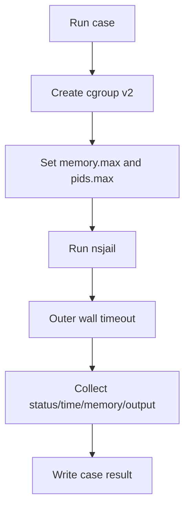

# Judge 资源限制

> 文档状态：需要运行验收
> 适用范围：Judge Worker 部署与运行验收
> 最后更新：2026-06-26

## 1. 文档目的

本文档说明 `judge-worker` 如何执行 time limit、memory limit、output limit、文件大小限制和进程限制。资源限制是评测系统安全和结果一致性的核心，不能只依赖字符串判断或外层超时。

## 2. 适用范围

适用于维护 `services/judge-worker`、worker Dockerfile、worker compose、语言配置和 E2E 运行验收的人员。Windows 静态环境只能验证代码构建，不能证明 nsjail/cgroup 运行限制生效。

## 3. 当前实现

worker 使用 nsjail 运行用户程序，并为每个 case 建立独立资源上下文。内存限制优先使用 cgroup v2，时间限制同时使用 nsjail time limit 和外层 wall timeout，输出和日志有大小限制。相关路径：

- `services/judge-worker/src/sandbox.rs`
- `services/judge-worker/src/cgroup.rs`
- `services/judge-worker/src/judge.rs`
- `services/judge-worker/config/languages.yaml`
- `deploy/worker/docker-compose.yml`

## 4. 限制机制

| 限制 | 机制 | 预期结果 |
| --- | --- | --- |
| time limit | nsjail `--time_limit` + 外层 wall timeout | `TIME_LIMIT_EXCEEDED` |
| memory limit | cgroup v2 `memory.max` | `MEMORY_LIMIT_EXCEEDED` |
| peak memory | cgroup v2 `memory.peak`，必要时读取 `memory.current` | `memory_kb` 不恒为 0 |
| OOM detection | cgroup v2 `memory.events` | MLE 不能误判为 RE/SYSTEM_ERROR |
| output limit | stdout/stderr 有界文件 + `rlimit_fsize` | `OUTPUT_LIMIT_EXCEEDED` |
| compile output | 编译日志大小限制 | CE 或 OLE，不无限增长 |
| checker log | checker log 截断 | 管理调试可读但不泄露路径 |
| process limit | `rlimit_nproc` + cgroup `pids.max` | fork bomb 被限制 |
| file descriptors | `rlimit_nofile` | 文件耗尽不拖垮 worker |

## 5. 关键流程



每个 case 必须独立执行，不能复用上一个 case 的资源上下文，避免内存峰值、进程和输出文件互相污染。

## 6. Linux host 检查

```bash
test -f /sys/fs/cgroup/cgroup.controllers
cat /sys/fs/cgroup/cgroup.controllers
```

预期包含 `memory` 和 `pids`。如果缺少 cgroup v2 或 controller，worker 必须 fail fast，不能静默降级成无内存限制。

## 7. Docker worker 权限边界

worker 容器需要 nsjail 和 cgroup 所需的最小能力。生产部署不允许使用危险的全权限容器作为默认方案。若某个环境确实需要额外 capability 或 cgroup mount，必须在部署文档中说明原因、最小权限和风险。

## 8. 状态一致性要求

- MLE 必须是 `MEMORY_LIMIT_EXCEEDED`，不能误判为 `RUNTIME_ERROR` 或 `SYSTEM_ERROR`。
- OLE 必须是 `OUTPUT_LIMIT_EXCEEDED`，不能折叠到 `RUNTIME_ERROR`。
- TLE 必须清理整个进程树，不能留下孤儿进程。
- `memory_kb` 应来自 cgroup 峰值或等价指标，不应长期恒为 0。

## 9. 配置说明

语言运行配置位于 `services/judge-worker/config/languages.yaml`。题目包提供默认 time/memory 限制，worker 配置提供输出大小、编译限制、工作目录、并发和日志级别。

## 10. 验收方式

在 Linux + Docker daemon + nsjail + cgroup v2 环境执行：

```bash
OJOS_WORKER_TOKEN=<token> bash scripts/e2e-linux.sh
```

必须验证：AC、WA、CE、RE、TLE、MLE、OLE、非法文件读取、fork bomb 和大 stderr。Windows 静态验证不能替代这些运行检查。

## 11. 常见问题

- `memory_kb` 为 0：检查 `memory.peak` 是否可读、cgroup 路径是否正确。
- MLE 变成 RE：检查 `memory.events` 和 OOM 判断。
- OLE 不触发：检查 stdout/stderr 限制和文件大小限制。
- worker 被 fork bomb 拖垮：检查 `pids.max` 和 `rlimit_nproc`。

## 12. 相关文档

- [Judge 状态模型](judge-status-model.md)
- [Linux 运行验收](../e2e/e2e-linux-runtime.md)
- [Worker Node 部署](../deploy/deploy-worker-node.md)
