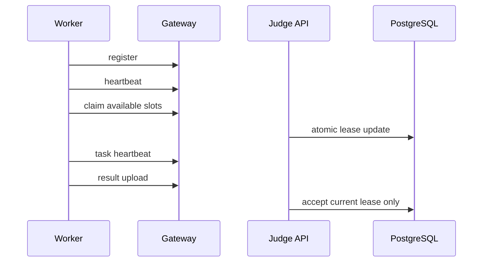

# Judge Worker 集群

> 文档状态：需要运行验收
> 适用范围：Judge Worker 集群 / 运维 / E2E 验收
> 最后更新：2026-06-26

## 1. 文档目的

本文档说明多 worker 并发评测、task lease、stale recovery 和 admin 观测方式。

## 2. 适用范围

适用于部署多台 worker、维护 Judge API 调度逻辑和验收 worker crash recovery 的人员。

## 3. 当前实现

worker 通过 Worker Link 注册、心跳、claim、下载 artifact、上传 result。PostgreSQL `judge_tasks` 是事实源，Redis Streams 是 signal history。

## 4. 目标设计

多 worker 应横向扩展，总并发由各 worker `OJOS_MAX_CONCURRENCY` 相加。后续可增加优先级和 contest queue 隔离。

## 5. 关键流程

## 6. 配置说明

关键配置包括 worker id、worker token、max concurrency、heartbeat interval、task lease TTL 和 supported languages。

## 7. 安全边界

worker 不直连 DB/Redis，不挂载 storage。旧 lease result 必须拒绝。

## 8. 验收方式

启动两个 worker，每个并发为 1，提交多份任务，确认没有重复评测；停掉一个 worker，任务能恢复。

## 9. 常见问题

- 单 worker 抢光任务：检查 claim 数量是否受 available slots 限制。
- 永久 JUDGING：检查 stale recovery。
- 旧结果覆盖：检查 `lease_version`。

## 10. 相关文档

- [Worker Link 协议](../architecture/worker-link-protocol.md)
- [Linux 运行验收](../e2e/e2e-linux-runtime.md)
