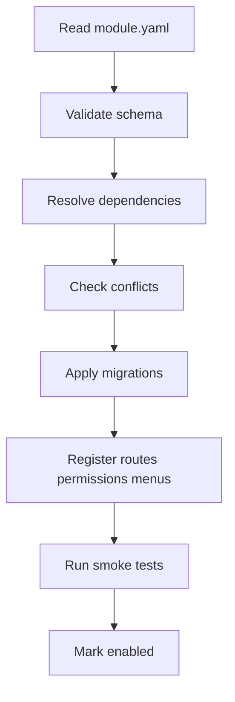

# 模块安装器

> 文档状态：目标架构
> 适用范围：架构设计 / 模块开发规划 / 运维
> 最后更新：2026-06-26

## 1. 文档目的

本文档描述目标架构中的 module installer。安装器是把模块从“文件和 manifest”变成“可运行能力”的执行器。

## 2. 适用范围

适用于后续实现 module registry、模块安装 CLI、管理后台模块页面和 Contest 热插拔验证。

## 3. 当前实现

当前仓库没有完整安装器。现有部署通过 compose、迁移文件和手写路由完成。本文档是目标架构约束，不能理解为当前已上线能力。

## 4. 目标设计

安装器 v0 应本地、确定性、可审计。它读取 `module.yaml`，校验 manifest，解析依赖，检测冲突，执行迁移，注册权限、菜单、Gateway route 和健康检查，然后运行 smoke test。

## 5. 关键流程

## 6. 配置说明

安装器需要平台版本、模块目录、迁移目录、数据库连接和审计写入权限。生产 secret 不应出现在模块包中。

安装器执行位置应属于 Control Plane 管理域，不能放在 worker node。它需要访问数据库和服务注册表，因此必须运行在可信网络内。安装器可以读取模块包中的 manifest 和迁移文件，但不能执行任意未审计脚本。需要外部二进制或构建步骤的模块，应先在 CI 中构建为可审计 artifact。

安装器日志应记录 module id、版本、操作者、开始时间、结束时间、状态、失败步骤和 request_id。日志不能记录生产 secret。

## 7. 安全边界

安装器必须由管理员触发，执行前做权限校验。失败时不能留下半注册路由或半注册权限。

## 8. 验收方式

用 Judge Core 和 Contest 模块验证安装、禁用、启用、升级失败和回滚。所有动作应有审计记录。

installer v0 的最小验收包括：

1. 安装合法模块成功，并能在管理页面看到状态。
2. 安装缺依赖模块失败，且没有写入半成品 route。
3. 安装迁移失败模块进入 `FAILED_INSTALL`。
4. 禁用模块后前端菜单消失，后端 route 返回不可用或 404。
5. 重新启用后 route 和菜单恢复。
6. 所有动作可以在审计记录中追溯。

## 9. 常见问题

- 迁移失败：停止安装并标记 `FAILED_INSTALL`。
- 权限冲突：安装前拒绝。
- 禁用后菜单仍显示：检查前端菜单注册状态。

## 10. 相关文档

- [模块契约](module-contract.md)
- [模块生命周期](module-lifecycle.md)
